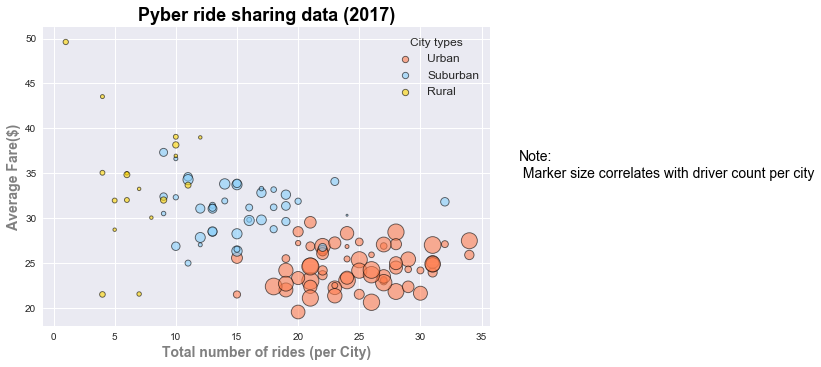

## This is the Pyber Data Challenge analysis.
### The analysis consists of 3 parts. 
* Data Retrieval
* Calculations and charts
    - Generating calculated fields from dataframe to carry out analysis  
    - Generating Pie and Bubble plots from using calculated fields  
* Findings from the analysis


```python
#Importing libraries
import pandas as pd
import matplotlib.pyplot as plt 
import numpy as np
```

### Retrieving Data from csv files to convert it to pandas dataframe


```python
#Assume the source file is in raw_data folder.
city_df = pd.read_csv('raw_data/city_data.csv')
city_df.head()
```


<div>
<style>
    .dataframe thead tr:only-child th {
        text-align: right;
    }

    .dataframe thead th {
        text-align: left;
    }

    .dataframe tbody tr th {
        vertical-align: top;
    }
</style>
<table border="1" class="dataframe">
  <thead>
    <tr style="text-align: right;">
      <th></th>
      <th>city</th>
      <th>driver_count</th>
      <th>type</th>
    </tr>
  </thead>
  <tbody>
    <tr>
      <th>0</th>
      <td>Kelseyland</td>
      <td>63</td>
      <td>Urban</td>
    </tr>
    <tr>
      <th>1</th>
      <td>Nguyenbury</td>
      <td>8</td>
      <td>Urban</td>
    </tr>
    <tr>
      <th>2</th>
      <td>East Douglas</td>
      <td>12</td>
      <td>Urban</td>
    </tr>
    <tr>
      <th>3</th>
      <td>West Dawnfurt</td>
      <td>34</td>
      <td>Urban</td>
    </tr>
    <tr>
      <th>4</th>
      <td>Rodriguezburgh</td>
      <td>52</td>
      <td>Urban</td>
    </tr>
  </tbody>
</table>
</div>


```python
#As Port James has 2 entries in source file. suburban-13 and suburban-5, grouping it and adding it to get right % in pie charts later
city_df = city_df.groupby(['city','type'] ,as_index = False)['driver_count'].sum()
city_df.head()
```


<div>
<style>
    .dataframe thead tr:only-child th {
        text-align: right;
    }

    .dataframe thead th {
        text-align: left;
    }

    .dataframe tbody tr th {
        vertical-align: top;
    }
</style>
<table border="1" class="dataframe">
  <thead>
    <tr style="text-align: right;">
      <th></th>
      <th>city</th>
      <th>type</th>
      <th>driver_count</th>
    </tr>
  </thead>
  <tbody>
    <tr>
      <th>0</th>
      <td>Alvarezhaven</td>
      <td>Urban</td>
      <td>21</td>
    </tr>
    <tr>
      <th>1</th>
      <td>Alyssaberg</td>
      <td>Urban</td>
      <td>67</td>
    </tr>
    <tr>
      <th>2</th>
      <td>Anitamouth</td>
      <td>Suburban</td>
      <td>16</td>
    </tr>
    <tr>
      <th>3</th>
      <td>Antoniomouth</td>
      <td>Urban</td>
      <td>21</td>
    </tr>
    <tr>
      <th>4</th>
      <td>Aprilchester</td>
      <td>Urban</td>
      <td>49</td>
    </tr>
  </tbody>
</table>
</div>


```python
#coverting csv file 2 into dataframe, assuming file is located in raw_data folder
ride_df = pd.read_csv('raw_data/ride_data.csv')
ride_df.head()
```


<div>
<style>
    .dataframe thead tr:only-child th {
        text-align: right;
    }

    .dataframe thead th {
        text-align: left;
    }

    .dataframe tbody tr th {
        vertical-align: top;
    }
</style>
<table border="1" class="dataframe">
  <thead>
    <tr style="text-align: right;">
      <th></th>
      <th>city</th>
      <th>date</th>
      <th>fare</th>
      <th>ride_id</th>
    </tr>
  </thead>
  <tbody>
    <tr>
      <th>0</th>
      <td>Sarabury</td>
      <td>2016-01-16 13:49:27</td>
      <td>38.35</td>
      <td>5403689035038</td>
    </tr>
    <tr>
      <th>1</th>
      <td>South Roy</td>
      <td>2016-01-02 18:42:34</td>
      <td>17.49</td>
      <td>4036272335942</td>
    </tr>
    <tr>
      <th>2</th>
      <td>Wiseborough</td>
      <td>2016-01-21 17:35:29</td>
      <td>44.18</td>
      <td>3645042422587</td>
    </tr>
    <tr>
      <th>3</th>
      <td>Spencertown</td>
      <td>2016-07-31 14:53:22</td>
      <td>6.87</td>
      <td>2242596575892</td>
    </tr>
    <tr>
      <th>4</th>
      <td>Nguyenbury</td>
      <td>2016-07-09 04:42:44</td>
      <td>6.28</td>
      <td>1543057793673</td>
    </tr>
  </tbody>
</table>
</div>


```python
#merging above 2 df to carry out further calculations
cityride = pd.merge(ride_df, city_df, how='inner', on=('city')).rename(columns={'type': 'city_type'})[['city','city_type','driver_count','fare','date','ride_id']]
cityride.head()
```


<div>
<style>
    .dataframe thead tr:only-child th {
        text-align: right;
    }

    .dataframe thead th {
        text-align: left;
    }

    .dataframe tbody tr th {
        vertical-align: top;
    }
</style>
<table border="1" class="dataframe">
  <thead>
    <tr style="text-align: right;">
      <th></th>
      <th>city</th>
      <th>city_type</th>
      <th>driver_count</th>
      <th>fare</th>
      <th>date</th>
      <th>ride_id</th>
    </tr>
  </thead>
  <tbody>
    <tr>
      <th>0</th>
      <td>Sarabury</td>
      <td>Urban</td>
      <td>46</td>
      <td>38.35</td>
      <td>2016-01-16 13:49:27</td>
      <td>5403689035038</td>
    </tr>
    <tr>
      <th>1</th>
      <td>Sarabury</td>
      <td>Urban</td>
      <td>46</td>
      <td>21.76</td>
      <td>2016-07-23 07:42:44</td>
      <td>7546681945283</td>
    </tr>
    <tr>
      <th>2</th>
      <td>Sarabury</td>
      <td>Urban</td>
      <td>46</td>
      <td>38.03</td>
      <td>2016-04-02 04:32:25</td>
      <td>4932495851866</td>
    </tr>
    <tr>
      <th>3</th>
      <td>Sarabury</td>
      <td>Urban</td>
      <td>46</td>
      <td>26.82</td>
      <td>2016-06-23 05:03:41</td>
      <td>6711035373406</td>
    </tr>
    <tr>
      <th>4</th>
      <td>Sarabury</td>
      <td>Urban</td>
      <td>46</td>
      <td>30.30</td>
      <td>2016-09-30 12:48:34</td>
      <td>6388737278232</td>
    </tr>
  </tbody>
</table>
</div>


```python
#getting city_types from dataframe to use for pie charts
cities = cityride['city_type'].unique()
cities
```


    array(['Urban', 'Suburban', 'Rural'], dtype=object)


### Generating pie chart for Total fare by city type


```python
#calculating fare by city type from dataframe
fare = cityride.groupby('city_type', sort=False).sum()['fare']
fare
```


    city_type
    Urban       40078.34
    Suburban    19317.88
    Rural        4255.09
    Name: fare, dtype: float64


```python
#defining different plot elements
labels = cities
colors = ['lightcoral','lightskyblue','Gold']
explode = (0.075,0,0)
plt.title('% of Total fare by city type', color = 'black',size = 15,bbox={'facecolor':'1','pad':5})

#pie plot 
byfare = plt.pie(fare, explode=explode, labels=labels,labeldistance = 1.1,pctdistance = 0.6,radius = 1.1, colors=colors ,autopct="%.1f%%",
        shadow=True, startangle=250)
plt.axis("equal")
#plt.tight_layout
#plt.legend(cities, loc = 'center right')


plt.savefig("%Tfare_by_City_Type_pie.png")
plt.show(byfare)
```


### Generating pie chart for Total rides by city type


```python
#count rides by city type
rides = cityride.groupby('city_type', sort=False).count()['ride_id'] 
rides

```


    city_type
    Urban       1625
    Suburban     625
    Rural        125
    Name: ride_id, dtype: int64


```python

plt.title('% of Total rides by city type', size = 15,color = 'black',bbox={'facecolor': '1','pad':5})

#plotting pie chart
byride = plt.pie(rides, labels=labels, colors=colors,radius = 1.2,explode=explode, autopct = "%.1f%%",
pctdistance = 0.7,shadow = True,startangle = 230)

plt.axis("equal")

plt.savefig('%Trides_city_type.png')
plt.show(byride)
```


### Generating pie chart for Total drivers by city type


```python
#calculating total driver counts by city type
agg = cityride.groupby(['city_type','city'], as_index = False, sort=False)['driver_count'].mean() 
drivers = agg.groupby('city_type', sort=False)['driver_count'].sum()
drivers

```


    city_type
    Urban       2607
    Suburban     638
    Rural        104
    Name: driver_count, dtype: int64


```python

plt.title("% of Total Drivers by city type",size = 15, color = 'black',bbox={'facecolor': '1', 'pad': 5})

#plotting the pie chart
bydrivers = plt.pie(drivers, labels=labels, explode=explode,radius=1.2, colors=colors,shadow=True,
autopct = "%.1f%%",startangle = 230)
plt.axis('equal')
plt.savefig('%Tdrivers_city_type.png')
plt.show(bydrivers)

```


### Parameter calculations for Bubble plot


```python
#calculating total rides per city for bubble plot
total_rides = cityride.groupby(['city','city_type'], as_index = False)['ride_id'].count()
total_rides.head()
```


<div>
<style>
    .dataframe thead tr:only-child th {
        text-align: right;
    }

    .dataframe thead th {
        text-align: left;
    }

    .dataframe tbody tr th {
        vertical-align: top;
    }
</style>
<table border="1" class="dataframe">
  <thead>
    <tr style="text-align: right;">
      <th></th>
      <th>city</th>
      <th>city_type</th>
      <th>ride_id</th>
    </tr>
  </thead>
  <tbody>
    <tr>
      <th>0</th>
      <td>Alvarezhaven</td>
      <td>Urban</td>
      <td>31</td>
    </tr>
    <tr>
      <th>1</th>
      <td>Alyssaberg</td>
      <td>Urban</td>
      <td>26</td>
    </tr>
    <tr>
      <th>2</th>
      <td>Anitamouth</td>
      <td>Suburban</td>
      <td>9</td>
    </tr>
    <tr>
      <th>3</th>
      <td>Antoniomouth</td>
      <td>Urban</td>
      <td>22</td>
    </tr>
    <tr>
      <th>4</th>
      <td>Aprilchester</td>
      <td>Urban</td>
      <td>19</td>
    </tr>
  </tbody>
</table>
</div>


```python
#calculating average fare per city for bubble plot
avg_fare = cityride.groupby(['city', 'city_type'], as_index=False)['fare'].mean()
avg_fare.head()
```


<div>
<style>
    .dataframe thead tr:only-child th {
        text-align: right;
    }

    .dataframe thead th {
        text-align: left;
    }

    .dataframe tbody tr th {
        vertical-align: top;
    }
</style>
<table border="1" class="dataframe">
  <thead>
    <tr style="text-align: right;">
      <th></th>
      <th>city</th>
      <th>city_type</th>
      <th>fare</th>
    </tr>
  </thead>
  <tbody>
    <tr>
      <th>0</th>
      <td>Alvarezhaven</td>
      <td>Urban</td>
      <td>23.928710</td>
    </tr>
    <tr>
      <th>1</th>
      <td>Alyssaberg</td>
      <td>Urban</td>
      <td>20.609615</td>
    </tr>
    <tr>
      <th>2</th>
      <td>Anitamouth</td>
      <td>Suburban</td>
      <td>37.315556</td>
    </tr>
    <tr>
      <th>3</th>
      <td>Antoniomouth</td>
      <td>Urban</td>
      <td>23.625000</td>
    </tr>
    <tr>
      <th>4</th>
      <td>Aprilchester</td>
      <td>Urban</td>
      <td>21.981579</td>
    </tr>
  </tbody>
</table>
</div>


```python
#calculating total drivers per city for bubble plot
total_drivers = cityride.groupby(['city','city_type'], as_index = False)['driver_count'].mean()
total_drivers.head()
```


<div>
<style>
    .dataframe thead tr:only-child th {
        text-align: right;
    }

    .dataframe thead th {
        text-align: left;
    }

    .dataframe tbody tr th {
        vertical-align: top;
    }
</style>
<table border="1" class="dataframe">
  <thead>
    <tr style="text-align: right;">
      <th></th>
      <th>city</th>
      <th>city_type</th>
      <th>driver_count</th>
    </tr>
  </thead>
  <tbody>
    <tr>
      <th>0</th>
      <td>Alvarezhaven</td>
      <td>Urban</td>
      <td>21</td>
    </tr>
    <tr>
      <th>1</th>
      <td>Alyssaberg</td>
      <td>Urban</td>
      <td>67</td>
    </tr>
    <tr>
      <th>2</th>
      <td>Anitamouth</td>
      <td>Suburban</td>
      <td>16</td>
    </tr>
    <tr>
      <th>3</th>
      <td>Antoniomouth</td>
      <td>Urban</td>
      <td>21</td>
    </tr>
    <tr>
      <th>4</th>
      <td>Aprilchester</td>
      <td>Urban</td>
      <td>49</td>
    </tr>
  </tbody>
</table>
</div>


```python
#merging dataframes to plot bubble plot

bubble = pd.merge(pd.merge(total_rides, avg_fare,on=('city','city_type')),total_drivers, on=('city','city_type')).rename(columns={'ride_id':'ride_count','fare':'avg_fare'})
bubble.head()

```


<div>
<style>
    .dataframe thead tr:only-child th {
        text-align: right;
    }

    .dataframe thead th {
        text-align: left;
    }

    .dataframe tbody tr th {
        vertical-align: top;
    }
</style>
<table border="1" class="dataframe">
  <thead>
    <tr style="text-align: right;">
      <th></th>
      <th>city</th>
      <th>city_type</th>
      <th>ride_count</th>
      <th>avg_fare</th>
      <th>driver_count</th>
    </tr>
  </thead>
  <tbody>
    <tr>
      <th>0</th>
      <td>Alvarezhaven</td>
      <td>Urban</td>
      <td>31</td>
      <td>23.928710</td>
      <td>21</td>
    </tr>
    <tr>
      <th>1</th>
      <td>Alyssaberg</td>
      <td>Urban</td>
      <td>26</td>
      <td>20.609615</td>
      <td>67</td>
    </tr>
    <tr>
      <th>2</th>
      <td>Anitamouth</td>
      <td>Suburban</td>
      <td>9</td>
      <td>37.315556</td>
      <td>16</td>
    </tr>
    <tr>
      <th>3</th>
      <td>Antoniomouth</td>
      <td>Urban</td>
      <td>22</td>
      <td>23.625000</td>
      <td>21</td>
    </tr>
    <tr>
      <th>4</th>
      <td>Aprilchester</td>
      <td>Urban</td>
      <td>19</td>
      <td>21.981579</td>
      <td>49</td>
    </tr>
  </tbody>
</table>
</div>


### Generating Bubble plot using above calculated parameters


```python
#create figure
fig = plt.figure()

#importing seaborn for plot style

import seaborn as sns
sns.set(style = 'darkgrid', color_codes=True)

#setting size of marker for urban city type based on driver count
urban = bubble['driver_count'][bubble['city_type']=='Urban']
u = [v*4 for i,v in urban.items()]

#plotting scatter for urban cities

plt.scatter(bubble['ride_count'][bubble['city_type']=='Urban'],
bubble['avg_fare'][bubble['city_type']=='Urban'], s=u ,marker='o', linewidth=0.9, edgecolor='black', color = 'coral',
alpha=0.6,label='Urban')


#setting marker size for suburban cities based on driver count
suburban = bubble['driver_count'][bubble['city_type']=='Suburban']
s = [v*4 for i,v in suburban.items()]

#creating scatter plot where city-type = suburban

plt.scatter(bubble['ride_count'][bubble['city_type']=='Suburban'],
bubble['avg_fare'][bubble['city_type']=='Suburban'],s=s,marker='o',linewidth=0.9,edgecolor='black', color = 'lightskyblue',
alpha=0.6,label='Suburban')

#setting marker size for Rural cities based on driver count
rural = bubble['driver_count'][bubble['city_type']=='Rural']
r = [v*4 for i,v in rural.items()]

#creating scatter plot where city-type = Rural

plt.scatter(bubble['ride_count'][bubble['city_type']=='Rural'],
bubble['avg_fare'][bubble['city_type']=='Rural'],s=r,marker='o', linewidth=0.9,edgecolor='black', color = 'gold',alpha=0.6,label='Rural')

#setting up plot elements - labels, Title, text, legends

plt.xlabel("Total number of rides (per City)", color = 'grey', weight = 'bold', fontsize = 14)
plt.ylabel("Average Fare($)", color = 'grey', weight = 'bold', fontsize = 14)

plt.title("Pyber ride sharing data (2017)", color = 'black', weight = 'bold', fontsize = 18)

plt.figtext(0.95,0.5,'Note:\n Marker size correlates with driver count per city', color = 'black', fontsize=14)
lgnd = plt.legend(cities, title='City types', loc =1 , shadow = True, fontsize = 12)

lgnd.legendHandles[0]._sizes = [40]
lgnd.legendHandles[1]._sizes = [40]
lgnd.legendHandles[2]._sizes = [40]

plt.savefig("bubble.png")
plt.show()
```





### Findings from the data:
1. Urban cities have maximum share of the drivers (approx 78%) and fare (appprox 63%)
2. Rural cities have least number of drivers(approx 3%) yet hold approx 6% of the fare. It means it pays more to be a driver in rural cities - approx $40 per driver.
3. As far as earnings are concerned, Urban cities appear close to saturation level. Hence, more drivers should be employed in suburban and rural cities to increase earnings.
