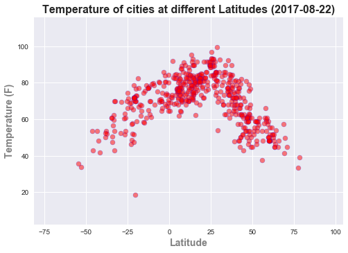
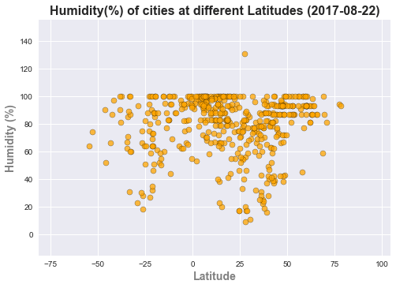
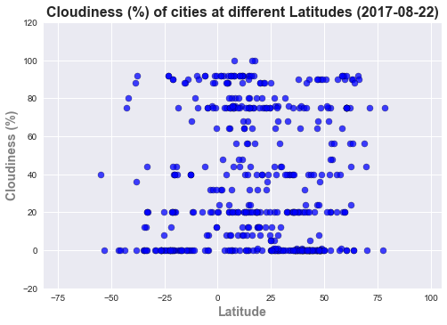
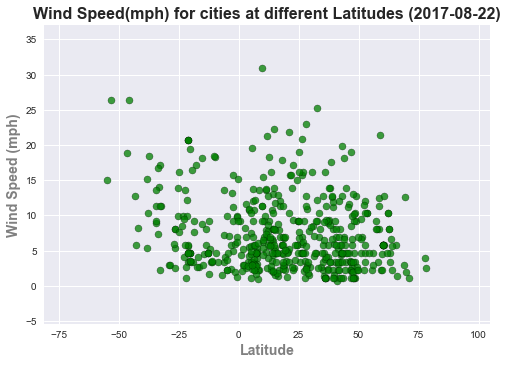

### This is UCB Bootcamp - week6 assignment - Weather Data Analysis

The purpose of this exercise is to find out the pattern in Latitude and various weather characteristics like - Temperature, Humidity, Cloudiness etc. This analysis consists of 3 parts.

* Data Retrieval - from APIs and storing data into dataframe
* Charts
* Findings/Analysis


```python
#Importing required libraries:

import random
from citipy import citipy
import matplotlib.pyplot as plt
import seaborn as sns
import pandas as pd
import json
import requests as req
import datetime
import time
```


```python
#Defining a function to randomly generate a values for latitude and longitude

def newpoint():
   return random.uniform(-90,90) , random.uniform(-180,180)
```

This piece of code below does most important task of the code. It grabs city name and country code using randomly generated coordinated and citipy package. It also makes sure that no city is repeated and all cities captured are from different regions of the world.


```python
#initializing variables and counter

city_counter = 0
citylist2=[]
countrylist={}

while city_counter < 500:
    point0 = newpoint()
    city=citipy.nearest_city(point0[0],point0[1])
    cityname = city.city_name
    countryname = city.country_code
   
    if countryname not in countrylist:
        countrylist[countryname] = 0
        
    if (cityname not in citylist2 and countrylist[countryname] < 3):
        citylist2.append(cityname)
        countrylist[countryname] += 1
        city_counter+=1
        print(f"city#{city_counter}: {cityname}, country_code: {countryname}")
            
print(len(citylist2))
```

    city#1: kahului, country_code: us
    city#2: rikitea, country_code: pf
    city#3: kato glikovrisi, country_code: gr
    city#4: sorland, country_code: no
    city#5: bluff, country_code: nz
    city#6: kapaa, country_code: us
    city#7: ushuaia, country_code: ar
    city#8: aswan, country_code: eg
    city#9: verkhnetulomskiy, country_code: ru
    city#10: hilo, country_code: us
    city#11: belushya guba, country_code: ru
    city#12: maragogi, country_code: br
    city#13: busselton, country_code: au
    city#14: santa isabel do rio negro, country_code: br
    city#15: mataura, country_code: pf
    city#16: lahij, country_code: ye
    city#17: katsuura, country_code: jp
    city#18: puerto ayora, country_code: ec
    city#19: new norfolk, country_code: au
    city#20: mys shmidta, country_code: ru
    city#21: hithadhoo, country_code: mv
    city#22: tsihombe, country_code: mg
    city#23: kiunga, country_code: pg
    city#24: bengkulu, country_code: id
    city#25: kwinana, country_code: au
    city#26: kardamaina, country_code: gr
    city#27: mahebourg, country_code: mu
    city#28: clyde river, country_code: ca
    city#29: taolanaro, country_code: mg
    city#30: san pedro, country_code: bo
    city#31: punta arenas, country_code: cl
    city#32: touros, country_code: br
    city#33: lyngseidet, country_code: no
    city#34: tuktoyaktuk, country_code: ca
    city#35: upernavik, country_code: gl
    city#36: tshane, country_code: bw
    city#37: kuche, country_code: cn
    city#38: derzhavinsk, country_code: kz
    city#39: kavaratti, country_code: in
    city#40: vardo, country_code: no
    city#41: nanortalik, country_code: gl
    city#42: talcahuano, country_code: cl
    city#43: nauta, country_code: pe
    city#44: atuona, country_code: pf
    city#45: hofn, country_code: is
    city#46: bredasdorp, country_code: za
    city#47: cabo san lucas, country_code: mx
    city#48: nioro, country_code: ml
    city#49: santiago del estero, country_code: ar
    city#50: cape town, country_code: za
    city#51: qiqihar, country_code: cn
    city#52: muros, country_code: es
    city#53: yellowknife, country_code: ca
    city#54: castro, country_code: cl
    city#55: qianjiang, country_code: cn
    city#56: salalah, country_code: om
    city#57: schlitz, country_code: de
    city#58: georgetown, country_code: sh
    city#59: jamestown, country_code: sh
    city#60: westport, country_code: nz
    city#61: sompeta, country_code: in
    city#62: talara, country_code: pe
    city#63: monrovia, country_code: lr
    city#64: kruisfontein, country_code: za
    city#65: butaritari, country_code: ki
    city#66: hambantota, country_code: lk
    city#67: mar del plata, country_code: ar
    city#68: ituni, country_code: gy
    city#69: longyearbyen, country_code: sj
    city#70: punta de bombon, country_code: pe
    city#71: puerto castilla, country_code: hn
    city#72: illoqqortoormiut, country_code: gl
    city#73: meulaboh, country_code: id
    city#74: husavik, country_code: is
    city#75: sungaipenuh, country_code: id
    city#76: airai, country_code: pw
    city#77: saint-philippe, country_code: re
    city#78: murwara, country_code: in
    city#79: tuatapere, country_code: nz
    city#80: chuy, country_code: uy
    city#81: san jeronimo, country_code: mx
    city#82: shimoda, country_code: jp
    city#83: vaini, country_code: to
    city#84: bouar, country_code: cf
    city#85: guerrero negro, country_code: mx
    city#86: vila franca do campo, country_code: pt
    city#87: naze, country_code: jp
    city#88: port moresby, country_code: pg
    city#89: alofi, country_code: nu
    city#90: sao filipe, country_code: cv
    city#91: lorengau, country_code: pg
    city#92: bandarbeyla, country_code: so
    city#93: brindisi, country_code: it
    city#94: vaitupu, country_code: wf
    city#95: victoria, country_code: sc
    city#96: valmiera, country_code: lv
    city#97: satitoa, country_code: ws
    city#98: poum, country_code: nc
    city#99: atsiki, country_code: gr
    city#100: tarudant, country_code: ma
    city#101: kilingi-nomme, country_code: ee
    city#102: tramagal, country_code: pt
    city#103: faranah, country_code: gn
    city#104: zamora, country_code: ec
    city#105: isangel, country_code: vu
    city#106: hamilton, country_code: bm
    city#107: namibe, country_code: ao
    city#108: avarua, country_code: ck
    city#109: barentsburg, country_code: sj
    city#110: saleaula, country_code: ws
    city#111: awbari, country_code: ly
    city#112: jacqueville, country_code: ci
    city#113: tambacounda, country_code: sn
    city#114: ribeira grande, country_code: pt
    city#115: ponta do sol, country_code: cv
    city#116: savelugu, country_code: gh
    city#117: katima mulilo, country_code: na
    city#118: marzuq, country_code: ly
    city#119: ostersund, country_code: se
    city#120: anar darreh, country_code: af
    city#121: bitkine, country_code: td
    city#122: san andres, country_code: co
    city#123: steti, country_code: cz
    city#124: gamboma, country_code: cg
    city#125: kuching, country_code: my
    city#126: adwa, country_code: et
    city#127: luderitz, country_code: na
    city#128: oistins, country_code: bb
    city#129: umm kaddadah, country_code: sd
    city#130: puerto del rosario, country_code: es
    city#131: toliary, country_code: mg
    city#132: umm lajj, country_code: sa
    city#133: mizpe ramon, country_code: il
    city#134: marrakesh, country_code: ma
    city#135: sinnamary, country_code: gf
    city#136: west bay, country_code: ky
    city#137: minab, country_code: ir
    city#138: karkaralinsk, country_code: kz
    city#139: el balyana, country_code: eg
    city#140: neiafu, country_code: to
    city#141: sulangan, country_code: ph
    city#142: kango, country_code: ga
    city#143: halalo, country_code: wf
    city#144: luena, country_code: ao
    city#145: doka, country_code: sd
    city#146: lashio, country_code: mm
    city#147: oranjestad, country_code: aw
    city#148: skagastrond, country_code: is
    city#149: vao, country_code: nc
    city#150: the valley, country_code: ai
    city#151: swakopmund, country_code: na
    city#152: uroteppa, country_code: tj
    city#153: atar, country_code: mr
    city#154: pointe-noire, country_code: gp
    city#155: mandera, country_code: ke
    city#156: bur gabo, country_code: so
    city#157: safaga, country_code: eg
    city#158: road town, country_code: vg
    city#159: marawi, country_code: sd
    city#160: ozgon, country_code: kg
    city#161: camacupa, country_code: ao
    city#162: sataua, country_code: ws
    city#163: cayenne, country_code: gf
    city#164: sibulan, country_code: ph
    city#165: miraflores, country_code: co
    city#166: grand river south east, country_code: mu
    city#167: ulaangom, country_code: mn
    city#168: cap malheureux, country_code: mu
    city#169: najran, country_code: sa
    city#170: fram, country_code: py
    city#171: butembo, country_code: cd
    city#172: tiznit, country_code: ma
    city#173: eregli, country_code: tr
    city#174: saint george, country_code: bm
    city#175: utiroa, country_code: ki
    city#176: sharjah, country_code: ae
    city#177: hagen, country_code: de
    city#178: sorvag, country_code: fo
    city#179: brodick, country_code: gb
    city#180: gurgan, country_code: az
    city#181: puerto el triunfo, country_code: sv
    city#182: klaksvik, country_code: fo
    city#183: kalmunai, country_code: lk
    city#184: ushtobe, country_code: kz
    city#185: baft, country_code: ir
    city#186: lolua, country_code: tv
    city#187: pedasi, country_code: pa
    city#188: saint-georges, country_code: gf
    city#189: puerto baquerizo moreno, country_code: ec
    city#190: ormara, country_code: pk
    city#191: darnetal, country_code: fr
    city#192: dicabisagan, country_code: ph
    city#193: pakxan, country_code: la
    city#194: birjand, country_code: ir
    city#195: malinyi, country_code: tz
    city#196: abu dhabi, country_code: ae
    city#197: caranavi, country_code: bo
    city#198: champerico, country_code: gt
    city#199: arlit, country_code: ne
    city#200: los llanos de aridane, country_code: es
    city#201: rovaniemi, country_code: fi
    city#202: eisenhuttenstadt, country_code: de
    city#203: port-gentil, country_code: ga
    city#204: san ramon, country_code: bo
    city#205: suhut, country_code: tr
    city#206: mardin, country_code: tr
    city#207: gambela, country_code: et
    city#208: thinadhoo, country_code: mv
    city#209: scarborough, country_code: tt
    city#210: miri, country_code: my
    city#211: sayyan, country_code: ye
    city#212: qui nhon, country_code: vn
    city#213: san rafael del sur, country_code: ni
    city#214: brae, country_code: gb
    city#215: karonga, country_code: mw
    city#216: rafai, country_code: cf
    city#217: tolentino, country_code: it
    city#218: bignona, country_code: sn
    city#219: mao, country_code: td
    city#220: bomet, country_code: ke
    city#221: dubti, country_code: et
    city#222: iralaya, country_code: hn
    city#223: ventspils, country_code: lv
    city#224: goderich, country_code: sl
    city#225: mocuba, country_code: mz
    city#226: meaux, country_code: fr
    city#227: bargal, country_code: so
    city#228: ye, country_code: mm
    city#229: bouna, country_code: ci
    city#230: mitsamiouli, country_code: km
    city#231: la asuncion, country_code: ve
    city#232: beira, country_code: mz
    city#233: phan thiet, country_code: vn
    city#234: goundi, country_code: td
    city#235: tanshui, country_code: tw
    city#236: catacamas, country_code: hn
    city#237: urambo, country_code: tz
    city#238: carlisle, country_code: ag
    city#239: isiro, country_code: cd
    city#240: ouadda, country_code: cf
    city#241: goure, country_code: ne
    city#242: malaryta, country_code: by
    city#243: bubaque, country_code: gw
    city#244: aflu, country_code: dz
    city#245: bathsheba, country_code: bb
    city#246: muli, country_code: mv
    city#247: phnum penh, country_code: kh
    city#248: saint-pierre, country_code: pm
    city#249: bukene, country_code: tz
    city#250: samfya, country_code: zm
    city#251: kachikau, country_code: bw
    city#252: rocha, country_code: uy
    city#253: marsala, country_code: it
    city#254: mantua, country_code: cu
    city#255: dori, country_code: bf
    city#256: praia, country_code: cv
    city#257: chingola, country_code: zm
    city#258: radomsko, country_code: pl
    city#259: nokaneng, country_code: bw
    city#260: keti bandar, country_code: pk
    city#261: matara, country_code: lk
    city#262: nouadhibou, country_code: mr
    city#263: saint-joseph, country_code: re
    city#264: honiara, country_code: sb
    city#265: sur, country_code: om
    city#266: warqla, country_code: dz
    city#267: lampang, country_code: th
    city#268: bodden town, country_code: ky
    city#269: ramonville-saint-agne, country_code: fr
    city#270: nelipyno, country_code: ua
    city#271: ginda, country_code: er
    city#272: xam nua, country_code: la
    city#273: jiddah, country_code: sa
    city#274: gat, country_code: ly
    city#275: chilibre, country_code: pa
    city#276: nkayi, country_code: cg
    city#277: codrington, country_code: ag
    city#278: steenbergen, country_code: nl
    city#279: buala, country_code: sb
    city#280: puerto ayacucho, country_code: ve
    city#281: yara, country_code: cu
    city#282: xai-xai, country_code: mz
    city#283: teshie, country_code: gh
    city#284: cabanas, country_code: cu
    city#285: gomel, country_code: by
    city#286: bilma, country_code: ne
    city#287: san jose, country_code: gt
    city#288: harper, country_code: lr
    city#289: lyubech, country_code: ua
    city#290: dedougou, country_code: bf
    city#291: pak phanang, country_code: th
    city#292: nicoya, country_code: cr
    city#293: mabaruma, country_code: gy
    city#294: sola, country_code: vu
    city#295: cockburn town, country_code: bs
    city#296: bajah, country_code: tn
    city#297: dok kham tai, country_code: th
    city#298: charlestown, country_code: kn
    city#299: santa marta, country_code: co
    city#300: samana, country_code: do
    city#301: ilebo, country_code: cd
    city#302: corinto, country_code: ni
    city#303: dingle, country_code: ie
    city#304: asau, country_code: tv
    city#305: nkoteng, country_code: cm
    city#306: eslov, country_code: se
    city#307: taywarah, country_code: af
    city#308: burica, country_code: pa
    city#309: tacuarembo, country_code: uy
    city#310: birin, country_code: dz
    city#311: kidal, country_code: ml
    city#312: villa bruzual, country_code: ve
    city#313: chau doc, country_code: vn
    city#314: tabiauea, country_code: ki
    city#315: aden, country_code: ye
    city#316: bourail, country_code: nc
    city#317: kampong thum, country_code: kh
    city#318: varlezi, country_code: ro
    city#319: paidha, country_code: ug
    city#320: tabou, country_code: ci
    city#321: lata, country_code: sb
    city#322: clacton-on-sea, country_code: gb
    city#323: mbour, country_code: sn
    city#324: pedro juan caballero, country_code: py
    city#325: hirtshals, country_code: dk
    city#326: rogatica, country_code: ba
    city#327: lyantonde, country_code: ug
    city#328: manzil tamim, country_code: tn
    city#329: axim, country_code: gh
    city#330: filadelfia, country_code: py
    city#331: bartica, country_code: gy
    city#332: uruzgan, country_code: af
    city#333: gazipur, country_code: bd
    city#334: ylivieska, country_code: fi
    city#335: barentu, country_code: er
    city#336: nieuwpoort, country_code: an
    city#337: loksa, country_code: ee
    city#338: mutoko, country_code: zw
    city#339: sibu, country_code: my
    city#340: yaypan, country_code: uz
    city#341: yenagoa, country_code: ng
    city#342: ballina, country_code: ie
    city#343: mandalgovi, country_code: mn
    city#344: maghama, country_code: mr
    city#345: gura calitei, country_code: ro
    city#346: arvika, country_code: se
    city#347: saint-denis, country_code: re
    city#348: valea dragului, country_code: ro
    city#349: mayumba, country_code: ga
    city#350: ughelli, country_code: ng
    city#351: samarkand, country_code: uz
    city#352: acajutla, country_code: sv
    city#353: baghdad, country_code: iq
    city#354: bull savanna, country_code: jm
    city#355: zamberk, country_code: cz
    city#356: muhos, country_code: fi
    city#357: chichawatni, country_code: pk
    city#358: umm bab, country_code: qa
    city#359: kompaniyivka, country_code: ua
    city#360: conakry, country_code: gn
    city#361: boffa, country_code: gn
    city#362: ulaanbaatar, country_code: mn
    city#363: luganville, country_code: vu
    city#364: tessalit, country_code: ml
    city#365: jaipur hat, country_code: bd
    city#366: ashqelon, country_code: il
    city#367: qabis, country_code: tn
    city#368: doha, country_code: kw
    city#369: hihifo, country_code: to
    city#370: ilorin, country_code: ng
    city#371: san lawrenz, country_code: mt
    city#372: bonthe, country_code: sl
    city#373: senmonorom, country_code: kh
    city#374: bajos de haina, country_code: do
    city#375: puerto cabezas, country_code: ni
    city#376: sinjar, country_code: iq
    city#377: nchelenge, country_code: zm
    city#378: balkanabat, country_code: tm
    city#379: killybegs, country_code: ie
    city#380: nurota, country_code: uz
    city#381: akyab, country_code: mm
    city#382: jumla, country_code: np
    city#383: vestmanna, country_code: fo
    city#384: bushenyi, country_code: ug
    city#385: seoul, country_code: kr
    city#386: saint-francois, country_code: gp
    city#387: kabarnet, country_code: ke
    city#388: cibitoke, country_code: bi
    city#389: wangdiphodrang, country_code: bt
    city#390: teknaf, country_code: bd
    city#391: micomeseng, country_code: gq
    city#392: hanstholm, country_code: dk
    city#393: sembe, country_code: cg
    city#394: jibuti, country_code: dj
    city#395: marsh harbour, country_code: bs
    city#396: gwanda, country_code: zw
    city#397: morant bay, country_code: jm
    city#398: fomboni, country_code: km
    city#399: luba, country_code: gq
    city#400: crab hill, country_code: bb
    city#401: karakendzha, country_code: tj
    city#402: balatonkenese, country_code: hu
    city#403: santa cruz, country_code: cr
    city#404: murgab, country_code: tm
    city#405: hit, country_code: iq
    city#406: chipinge, country_code: zw
    city#407: varazdin, country_code: hr
    city#408: meinung, country_code: tw
    city#409: koungou, country_code: yt
    city#410: khor, country_code: qa
    city#411: mbengwi, country_code: cm
    city#412: george town, country_code: ky
    city#413: salamiyah, country_code: sy
    city#414: pokhara, country_code: np
    city#415: dunmore town, country_code: bs
    city#416: canaries, country_code: lc
    city#417: san francisco el alto, country_code: gt
    city#418: westpunt, country_code: an
    city#419: stolin, country_code: by
    city#420: abu kamal, country_code: sy
    city#421: parrita, country_code: cr
    city#422: abu samrah, country_code: qa
    city#423: aleppo, country_code: sy
    city#424: pag, country_code: hr
    city#425: rwamagana, country_code: rw
    city#426: dovers, country_code: vc
    city#427: domoni, country_code: km
    city#428: lucea, country_code: jm
    city#429: miquelon, country_code: pm
    city#430: orodara, country_code: bf
    city#431: khandbari, country_code: np
    city#432: otterup, country_code: dk
    city#433: luchou, country_code: tw
    city#434: gazanjyk, country_code: tm
    city#435: luang prabang, country_code: la
    city#436: kloulklubed, country_code: pw
    city#437: elat, country_code: il
    city#438: la libertad, country_code: sv
    city#439: les cayes, country_code: ht
    city#440: den helder, country_code: nl
    city#441: dingli, country_code: mt
    city#442: ypsonas, country_code: cy
    city#443: torun, country_code: pl
    city#444: totness, country_code: sr
    city#445: moletai, country_code: lt
    city#446: bohicon, country_code: bj
    city#447: skoczow, country_code: pl
    city#448: qazax, country_code: az
    city#449: nagybajom, country_code: hu
    city#450: meyungs, country_code: pw
    city#451: marienburg, country_code: sr
    city#452: mokhotlong, country_code: ls
    city#453: kant, country_code: kg
    city#454: kofarnihon, country_code: tj
    city#455: ilinden, country_code: mk
    city#456: kralendijk, country_code: an
    city#457: nizwa, country_code: om
    city#458: kavarna, country_code: bg
    city#459: sozopol, country_code: bg
    city#460: chitipa, country_code: mw
    city#461: vaskut, country_code: hu
    city#462: abong mbang, country_code: cm
    city#463: dubrovnik, country_code: hr
    city#464: polis, country_code: cy
    city#465: mponela, country_code: mw
    city#466: ivanjica, country_code: rs
    city#467: humenne, country_code: sk
    city#468: dubai, country_code: ae
    city#469: liku, country_code: wf
    city#470: kpalime, country_code: tg
    city#471: xacmaz, country_code: az
    city#472: malanville, country_code: bj
    city#473: badou, country_code: tg
    city#474: sakete, country_code: bj
    city#475: bandraboua, country_code: yt
    city#476: buchanan, country_code: lr
    city#477: detva, country_code: sk
    city#478: naujamiestis, country_code: lt
    city#479: samtredia, country_code: ge
    city#480: port-de-paix, country_code: ht
    city#481: bayan, country_code: kw
    city#482: ulcinj, country_code: me
    city#483: brokopondo, country_code: sr
    city#484: winsum, country_code: nl
    city#485: jurmala, country_code: lv
    city#486: houffalize, country_code: be
    city#487: rio claro, country_code: tt
    city#488: bani, country_code: do
    city#489: jazzin, country_code: lb
    city#490: manama, country_code: bh
    city#491: sarevere, country_code: ee
    city#492: bata, country_code: gq
    city#493: lemesos, country_code: cy
    city#494: veseli nad luznici, country_code: cz
    city#495: kuchl, country_code: at
    city#496: boueni, country_code: yt
    city#497: tamsweg, country_code: at
    city#498: beli potok, country_code: rs
    city#499: amlame, country_code: tg
    city#500: makhinjauri, country_code: ge
    500
    

#### Putting cities into dataframe and creating columns for other weather characteristics


```python
weather_df=pd.DataFrame(citylist2)
weather_df.columns = ['City']
weather_df['Country']=''
weather_df['Date']=''
weather_df['Lat']=''
weather_df['Lng']=''
weather_df['Max_Temperature']=''
weather_df['Humidity']=''
weather_df['Clouds']=''
weather_df['Wind_Speed']=''
weather_df.head()
```


<div>
<style>
    .dataframe thead tr:only-child th {
        text-align: right;
    }

    .dataframe thead th {
        text-align: left;
    }

    .dataframe tbody tr th {
        vertical-align: top;
    }
</style>
<table border="1" class="dataframe">
  <thead>
    <tr style="text-align: right;">
      <th></th>
      <th>City</th>
      <th>Country</th>
      <th>Date</th>
      <th>Lat</th>
      <th>Lng</th>
      <th>Max_Temperature</th>
      <th>Humidity</th>
      <th>Clouds</th>
      <th>Wind_Speed</th>
    </tr>
  </thead>
  <tbody>
    <tr>
      <th>0</th>
      <td>busselton</td>
      <td></td>
      <td></td>
      <td></td>
      <td></td>
      <td></td>
      <td></td>
      <td></td>
      <td></td>
    </tr>
    <tr>
      <th>1</th>
      <td>avarua</td>
      <td></td>
      <td></td>
      <td></td>
      <td></td>
      <td></td>
      <td></td>
      <td></td>
      <td></td>
    </tr>
    <tr>
      <th>2</th>
      <td>honningsvag</td>
      <td></td>
      <td></td>
      <td></td>
      <td></td>
      <td></td>
      <td></td>
      <td></td>
      <td></td>
    </tr>
    <tr>
      <th>3</th>
      <td>ribeira grande</td>
      <td></td>
      <td></td>
      <td></td>
      <td></td>
      <td></td>
      <td></td>
      <td></td>
      <td></td>
    </tr>
    <tr>
      <th>4</th>
      <td>tsihombe</td>
      <td></td>
      <td></td>
      <td></td>
      <td></td>
      <td></td>
      <td></td>
      <td></td>
      <td></td>
    </tr>
  </tbody>
</table>
</div>


#### Pinging Openweathermap API and retrieving data for use in charts


```python
#config
api_key = "25bc90a1196e6f153eece0bc0b0fc9eb"
url = "http://api.openweathermap.org/data/2.5/weather?"
units = "Imperial" #<-- to get temperature in Farenheit and wind speed in mph
```


```python
for idx, row in weather_df.iterrows():
    url = 'http://api.openweathermap.org/data/2.5/weather?appid=%s&units=%s&q=%s' % (api_key, units, row['City'])
    print(f" Collecting data for city # {idx+1} - {row['City']} : {url}\n")
    json_response = req.get(url).json()
    time.sleep(1)
    
    try:
        country = json_response['sys']['country']
        date = json_response['dt']
        latt = json_response['coord']['lat']
        long = json_response['coord']['lon']
        temp = json_response['main']['temp_max']
        humid = json_response['main']['humidity']
        cloudy = json_response['clouds']['all']
        winds = json_response['wind']['speed']
        
        
        weather_df.set_value(idx, "Country", country)
        weather_df.set_value(idx, "Date",  date)
        weather_df.set_value(idx, "Lat", latt)
        weather_df.set_value(idx, "Lng", long)
        weather_df.set_value(idx, "Max_Temperature", temp)
        weather_df.set_value(idx, "Humidity", humid)
        weather_df.set_value(idx, "Clouds", cloudy)
        weather_df.set_value(idx, "Wind_Speed", winds)
    except:
        print('error getting data')
    
```

     Collecting data for city # 1 - busselton : http://api.openweathermap.org/data/2.5/weather?appid=25bc90a1196e6f153eece0bc0b0fc9eb&units=Imperial&q=busselton
    
     Collecting data for city # 2 - avarua : http://api.openweathermap.org/data/2.5/weather?appid=25bc90a1196e6f153eece0bc0b0fc9eb&units=Imperial&q=avarua
    
     Collecting data for city # 3 - honningsvag : http://api.openweathermap.org/data/2.5/weather?appid=25bc90a1196e6f153eece0bc0b0fc9eb&units=Imperial&q=honningsvag
    
     Collecting data for city # 4 - ribeira grande : http://api.openweathermap.org/data/2.5/weather?appid=25bc90a1196e6f153eece0bc0b0fc9eb&units=Imperial&q=ribeira grande
    
     Collecting data for city # 5 - tsihombe : http://api.openweathermap.org/data/2.5/weather?appid=25bc90a1196e6f153eece0bc0b0fc9eb&units=Imperial&q=tsihombe
    
     Collecting data for city # 6 - mataura : http://api.openweathermap.org/data/2.5/weather?appid=25bc90a1196e6f153eece0bc0b0fc9eb&units=Imperial&q=mataura
    
     Collecting data for city # 7 - normandin : http://api.openweathermap.org/data/2.5/weather?appid=25bc90a1196e6f153eece0bc0b0fc9eb&units=Imperial&q=normandin
    
     Collecting data for city # 8 - tasiilaq : http://api.openweathermap.org/data/2.5/weather?appid=25bc90a1196e6f153eece0bc0b0fc9eb&units=Imperial&q=tasiilaq
    
     Collecting data for city # 9 - punta arenas : http://api.openweathermap.org/data/2.5/weather?appid=25bc90a1196e6f153eece0bc0b0fc9eb&units=Imperial&q=punta arenas
    
     Collecting data for city # 10 - husavik : http://api.openweathermap.org/data/2.5/weather?appid=25bc90a1196e6f153eece0bc0b0fc9eb&units=Imperial&q=husavik
    
     Collecting data for city # 11 - new norfolk : http://api.openweathermap.org/data/2.5/weather?appid=25bc90a1196e6f153eece0bc0b0fc9eb&units=Imperial&q=new norfolk
    
     Collecting data for city # 12 - hami : http://api.openweathermap.org/data/2.5/weather?appid=25bc90a1196e6f153eece0bc0b0fc9eb&units=Imperial&q=hami
    
     Collecting data for city # 13 - cherskiy : http://api.openweathermap.org/data/2.5/weather?appid=25bc90a1196e6f153eece0bc0b0fc9eb&units=Imperial&q=cherskiy
    
     Collecting data for city # 14 - hermanus : http://api.openweathermap.org/data/2.5/weather?appid=25bc90a1196e6f153eece0bc0b0fc9eb&units=Imperial&q=hermanus
    
     Collecting data for city # 15 - navahrudak : http://api.openweathermap.org/data/2.5/weather?appid=25bc90a1196e6f153eece0bc0b0fc9eb&units=Imperial&q=navahrudak
    
     Collecting data for city # 16 - pevek : http://api.openweathermap.org/data/2.5/weather?appid=25bc90a1196e6f153eece0bc0b0fc9eb&units=Imperial&q=pevek
    
     Collecting data for city # 17 - marsh harbour : http://api.openweathermap.org/data/2.5/weather?appid=25bc90a1196e6f153eece0bc0b0fc9eb&units=Imperial&q=marsh harbour
    
     Collecting data for city # 18 - nikolskoye : http://api.openweathermap.org/data/2.5/weather?appid=25bc90a1196e6f153eece0bc0b0fc9eb&units=Imperial&q=nikolskoye
    
     Collecting data for city # 19 - lasa : http://api.openweathermap.org/data/2.5/weather?appid=25bc90a1196e6f153eece0bc0b0fc9eb&units=Imperial&q=lasa
    
     Collecting data for city # 20 - vestmanna : http://api.openweathermap.org/data/2.5/weather?appid=25bc90a1196e6f153eece0bc0b0fc9eb&units=Imperial&q=vestmanna
    
     Collecting data for city # 21 - kodiak : http://api.openweathermap.org/data/2.5/weather?appid=25bc90a1196e6f153eece0bc0b0fc9eb&units=Imperial&q=kodiak
    
     Collecting data for city # 22 - ushuaia : http://api.openweathermap.org/data/2.5/weather?appid=25bc90a1196e6f153eece0bc0b0fc9eb&units=Imperial&q=ushuaia
    
     Collecting data for city # 23 - albany : http://api.openweathermap.org/data/2.5/weather?appid=25bc90a1196e6f153eece0bc0b0fc9eb&units=Imperial&q=albany
    
     Collecting data for city # 24 - tomatlan : http://api.openweathermap.org/data/2.5/weather?appid=25bc90a1196e6f153eece0bc0b0fc9eb&units=Imperial&q=tomatlan
    
     Collecting data for city # 25 - oistins : http://api.openweathermap.org/data/2.5/weather?appid=25bc90a1196e6f153eece0bc0b0fc9eb&units=Imperial&q=oistins
    
     Collecting data for city # 26 - taganak : http://api.openweathermap.org/data/2.5/weather?appid=25bc90a1196e6f153eece0bc0b0fc9eb&units=Imperial&q=taganak
    
     Collecting data for city # 27 - fukue : http://api.openweathermap.org/data/2.5/weather?appid=25bc90a1196e6f153eece0bc0b0fc9eb&units=Imperial&q=fukue
    
     Collecting data for city # 28 - pombas : http://api.openweathermap.org/data/2.5/weather?appid=25bc90a1196e6f153eece0bc0b0fc9eb&units=Imperial&q=pombas
    
     Collecting data for city # 29 - nabire : http://api.openweathermap.org/data/2.5/weather?appid=25bc90a1196e6f153eece0bc0b0fc9eb&units=Imperial&q=nabire
    
     Collecting data for city # 30 - coxim : http://api.openweathermap.org/data/2.5/weather?appid=25bc90a1196e6f153eece0bc0b0fc9eb&units=Imperial&q=coxim
    
     Collecting data for city # 31 - rikitea : http://api.openweathermap.org/data/2.5/weather?appid=25bc90a1196e6f153eece0bc0b0fc9eb&units=Imperial&q=rikitea
    
     Collecting data for city # 32 - georgetown : http://api.openweathermap.org/data/2.5/weather?appid=25bc90a1196e6f153eece0bc0b0fc9eb&units=Imperial&q=georgetown
    
     Collecting data for city # 33 - khonsa : http://api.openweathermap.org/data/2.5/weather?appid=25bc90a1196e6f153eece0bc0b0fc9eb&units=Imperial&q=khonsa
    
     Collecting data for city # 34 - matay : http://api.openweathermap.org/data/2.5/weather?appid=25bc90a1196e6f153eece0bc0b0fc9eb&units=Imperial&q=matay
    
     Collecting data for city # 35 - melilla : http://api.openweathermap.org/data/2.5/weather?appid=25bc90a1196e6f153eece0bc0b0fc9eb&units=Imperial&q=melilla
    
     Collecting data for city # 36 - saldanha : http://api.openweathermap.org/data/2.5/weather?appid=25bc90a1196e6f153eece0bc0b0fc9eb&units=Imperial&q=saldanha
    
     Collecting data for city # 37 - tostamaa : http://api.openweathermap.org/data/2.5/weather?appid=25bc90a1196e6f153eece0bc0b0fc9eb&units=Imperial&q=tostamaa
    
     Collecting data for city # 38 - nara : http://api.openweathermap.org/data/2.5/weather?appid=25bc90a1196e6f153eece0bc0b0fc9eb&units=Imperial&q=nara
    
     Collecting data for city # 39 - rio brilhante : http://api.openweathermap.org/data/2.5/weather?appid=25bc90a1196e6f153eece0bc0b0fc9eb&units=Imperial&q=rio brilhante
    
     Collecting data for city # 40 - siguiri : http://api.openweathermap.org/data/2.5/weather?appid=25bc90a1196e6f153eece0bc0b0fc9eb&units=Imperial&q=siguiri
    
     Collecting data for city # 41 - vaini : http://api.openweathermap.org/data/2.5/weather?appid=25bc90a1196e6f153eece0bc0b0fc9eb&units=Imperial&q=vaini
    
     Collecting data for city # 42 - sola : http://api.openweathermap.org/data/2.5/weather?appid=25bc90a1196e6f153eece0bc0b0fc9eb&units=Imperial&q=sola
    
     Collecting data for city # 43 - poum : http://api.openweathermap.org/data/2.5/weather?appid=25bc90a1196e6f153eece0bc0b0fc9eb&units=Imperial&q=poum
    
     Collecting data for city # 44 - araouane : http://api.openweathermap.org/data/2.5/weather?appid=25bc90a1196e6f153eece0bc0b0fc9eb&units=Imperial&q=araouane
    
     Collecting data for city # 45 - kapaa : http://api.openweathermap.org/data/2.5/weather?appid=25bc90a1196e6f153eece0bc0b0fc9eb&units=Imperial&q=kapaa
    
     Collecting data for city # 46 - qaanaaq : http://api.openweathermap.org/data/2.5/weather?appid=25bc90a1196e6f153eece0bc0b0fc9eb&units=Imperial&q=qaanaaq
    
     Collecting data for city # 47 - kutum : http://api.openweathermap.org/data/2.5/weather?appid=25bc90a1196e6f153eece0bc0b0fc9eb&units=Imperial&q=kutum
    
     Collecting data for city # 48 - atuona : http://api.openweathermap.org/data/2.5/weather?appid=25bc90a1196e6f153eece0bc0b0fc9eb&units=Imperial&q=atuona
    
     Collecting data for city # 49 - bandarbeyla : http://api.openweathermap.org/data/2.5/weather?appid=25bc90a1196e6f153eece0bc0b0fc9eb&units=Imperial&q=bandarbeyla
    
     Collecting data for city # 50 - bathsheba : http://api.openweathermap.org/data/2.5/weather?appid=25bc90a1196e6f153eece0bc0b0fc9eb&units=Imperial&q=bathsheba
    
     Collecting data for city # 51 - champerico : http://api.openweathermap.org/data/2.5/weather?appid=25bc90a1196e6f153eece0bc0b0fc9eb&units=Imperial&q=champerico
    
     Collecting data for city # 52 - vestmannaeyjar : http://api.openweathermap.org/data/2.5/weather?appid=25bc90a1196e6f153eece0bc0b0fc9eb&units=Imperial&q=vestmannaeyjar
    
     Collecting data for city # 53 - bluff : http://api.openweathermap.org/data/2.5/weather?appid=25bc90a1196e6f153eece0bc0b0fc9eb&units=Imperial&q=bluff
    
     Collecting data for city # 54 - marystown : http://api.openweathermap.org/data/2.5/weather?appid=25bc90a1196e6f153eece0bc0b0fc9eb&units=Imperial&q=marystown
    
     Collecting data for city # 55 - grindavik : http://api.openweathermap.org/data/2.5/weather?appid=25bc90a1196e6f153eece0bc0b0fc9eb&units=Imperial&q=grindavik
    
     Collecting data for city # 56 - arraial do cabo : http://api.openweathermap.org/data/2.5/weather?appid=25bc90a1196e6f153eece0bc0b0fc9eb&units=Imperial&q=arraial do cabo
    
     Collecting data for city # 57 - butaritari : http://api.openweathermap.org/data/2.5/weather?appid=25bc90a1196e6f153eece0bc0b0fc9eb&units=Imperial&q=butaritari
    
     Collecting data for city # 58 - mar del plata : http://api.openweathermap.org/data/2.5/weather?appid=25bc90a1196e6f153eece0bc0b0fc9eb&units=Imperial&q=mar del plata
    
     Collecting data for city # 59 - east london : http://api.openweathermap.org/data/2.5/weather?appid=25bc90a1196e6f153eece0bc0b0fc9eb&units=Imperial&q=east london
    
     Collecting data for city # 60 - ponta do sol : http://api.openweathermap.org/data/2.5/weather?appid=25bc90a1196e6f153eece0bc0b0fc9eb&units=Imperial&q=ponta do sol
    
     Collecting data for city # 61 - thompson : http://api.openweathermap.org/data/2.5/weather?appid=25bc90a1196e6f153eece0bc0b0fc9eb&units=Imperial&q=thompson
    
     Collecting data for city # 62 - san luis : http://api.openweathermap.org/data/2.5/weather?appid=25bc90a1196e6f153eece0bc0b0fc9eb&units=Imperial&q=san luis
    
     Collecting data for city # 63 - musafirkhana : http://api.openweathermap.org/data/2.5/weather?appid=25bc90a1196e6f153eece0bc0b0fc9eb&units=Imperial&q=musafirkhana
    
     Collecting data for city # 64 - kihei : http://api.openweathermap.org/data/2.5/weather?appid=25bc90a1196e6f153eece0bc0b0fc9eb&units=Imperial&q=kihei
    
     Collecting data for city # 65 - moron : http://api.openweathermap.org/data/2.5/weather?appid=25bc90a1196e6f153eece0bc0b0fc9eb&units=Imperial&q=moron
    
     Collecting data for city # 66 - taolanaro : http://api.openweathermap.org/data/2.5/weather?appid=25bc90a1196e6f153eece0bc0b0fc9eb&units=Imperial&q=taolanaro
    
     Collecting data for city # 67 - panixtlahuaca : http://api.openweathermap.org/data/2.5/weather?appid=25bc90a1196e6f153eece0bc0b0fc9eb&units=Imperial&q=panixtlahuaca
    
     Collecting data for city # 68 - pak phanang : http://api.openweathermap.org/data/2.5/weather?appid=25bc90a1196e6f153eece0bc0b0fc9eb&units=Imperial&q=pak phanang
    
     Collecting data for city # 69 - aljezur : http://api.openweathermap.org/data/2.5/weather?appid=25bc90a1196e6f153eece0bc0b0fc9eb&units=Imperial&q=aljezur
    
     Collecting data for city # 70 - susurluk : http://api.openweathermap.org/data/2.5/weather?appid=25bc90a1196e6f153eece0bc0b0fc9eb&units=Imperial&q=susurluk
    
     Collecting data for city # 71 - buraydah : http://api.openweathermap.org/data/2.5/weather?appid=25bc90a1196e6f153eece0bc0b0fc9eb&units=Imperial&q=buraydah
    
     Collecting data for city # 72 - puerto ayora : http://api.openweathermap.org/data/2.5/weather?appid=25bc90a1196e6f153eece0bc0b0fc9eb&units=Imperial&q=puerto ayora
    
     Collecting data for city # 73 - mladenovac : http://api.openweathermap.org/data/2.5/weather?appid=25bc90a1196e6f153eece0bc0b0fc9eb&units=Imperial&q=mladenovac
    
     Collecting data for city # 74 - illoqqortoormiut : http://api.openweathermap.org/data/2.5/weather?appid=25bc90a1196e6f153eece0bc0b0fc9eb&units=Imperial&q=illoqqortoormiut
    
     Collecting data for city # 75 - barentsburg : http://api.openweathermap.org/data/2.5/weather?appid=25bc90a1196e6f153eece0bc0b0fc9eb&units=Imperial&q=barentsburg
    
     Collecting data for city # 76 - lekoni : http://api.openweathermap.org/data/2.5/weather?appid=25bc90a1196e6f153eece0bc0b0fc9eb&units=Imperial&q=lekoni
    
     Collecting data for city # 77 - christchurch : http://api.openweathermap.org/data/2.5/weather?appid=25bc90a1196e6f153eece0bc0b0fc9eb&units=Imperial&q=christchurch
    
     Collecting data for city # 78 - airai : http://api.openweathermap.org/data/2.5/weather?appid=25bc90a1196e6f153eece0bc0b0fc9eb&units=Imperial&q=airai
    
     Collecting data for city # 79 - kaihua : http://api.openweathermap.org/data/2.5/weather?appid=25bc90a1196e6f153eece0bc0b0fc9eb&units=Imperial&q=kaihua
    
     Collecting data for city # 80 - gao : http://api.openweathermap.org/data/2.5/weather?appid=25bc90a1196e6f153eece0bc0b0fc9eb&units=Imperial&q=gao
    
     Collecting data for city # 81 - salalah : http://api.openweathermap.org/data/2.5/weather?appid=25bc90a1196e6f153eece0bc0b0fc9eb&units=Imperial&q=salalah
    
     Collecting data for city # 82 - victoria : http://api.openweathermap.org/data/2.5/weather?appid=25bc90a1196e6f153eece0bc0b0fc9eb&units=Imperial&q=victoria
    
     Collecting data for city # 83 - pipar : http://api.openweathermap.org/data/2.5/weather?appid=25bc90a1196e6f153eece0bc0b0fc9eb&units=Imperial&q=pipar
    
     Collecting data for city # 84 - jablah : http://api.openweathermap.org/data/2.5/weather?appid=25bc90a1196e6f153eece0bc0b0fc9eb&units=Imperial&q=jablah
    
     Collecting data for city # 85 - kalmunai : http://api.openweathermap.org/data/2.5/weather?appid=25bc90a1196e6f153eece0bc0b0fc9eb&units=Imperial&q=kalmunai
    
     Collecting data for city # 86 - saleaula : http://api.openweathermap.org/data/2.5/weather?appid=25bc90a1196e6f153eece0bc0b0fc9eb&units=Imperial&q=saleaula
    
     Collecting data for city # 87 - jomalig : http://api.openweathermap.org/data/2.5/weather?appid=25bc90a1196e6f153eece0bc0b0fc9eb&units=Imperial&q=jomalig
    
     Collecting data for city # 88 - hithadhoo : http://api.openweathermap.org/data/2.5/weather?appid=25bc90a1196e6f153eece0bc0b0fc9eb&units=Imperial&q=hithadhoo
    
     Collecting data for city # 89 - saint george : http://api.openweathermap.org/data/2.5/weather?appid=25bc90a1196e6f153eece0bc0b0fc9eb&units=Imperial&q=saint george
    
     Collecting data for city # 90 - klaksvik : http://api.openweathermap.org/data/2.5/weather?appid=25bc90a1196e6f153eece0bc0b0fc9eb&units=Imperial&q=klaksvik
    
     Collecting data for city # 91 - kibre mengist : http://api.openweathermap.org/data/2.5/weather?appid=25bc90a1196e6f153eece0bc0b0fc9eb&units=Imperial&q=kibre mengist
    
     Collecting data for city # 92 - ruatoria : http://api.openweathermap.org/data/2.5/weather?appid=25bc90a1196e6f153eece0bc0b0fc9eb&units=Imperial&q=ruatoria
    
     Collecting data for city # 93 - nacala : http://api.openweathermap.org/data/2.5/weather?appid=25bc90a1196e6f153eece0bc0b0fc9eb&units=Imperial&q=nacala
    
     Collecting data for city # 94 - san cristobal : http://api.openweathermap.org/data/2.5/weather?appid=25bc90a1196e6f153eece0bc0b0fc9eb&units=Imperial&q=san cristobal
    
     Collecting data for city # 95 - lebu : http://api.openweathermap.org/data/2.5/weather?appid=25bc90a1196e6f153eece0bc0b0fc9eb&units=Imperial&q=lebu
    
     Collecting data for city # 96 - henties bay : http://api.openweathermap.org/data/2.5/weather?appid=25bc90a1196e6f153eece0bc0b0fc9eb&units=Imperial&q=henties bay
    
     Collecting data for city # 97 - kieta : http://api.openweathermap.org/data/2.5/weather?appid=25bc90a1196e6f153eece0bc0b0fc9eb&units=Imperial&q=kieta
    
     Collecting data for city # 98 - san vicente : http://api.openweathermap.org/data/2.5/weather?appid=25bc90a1196e6f153eece0bc0b0fc9eb&units=Imperial&q=san vicente
    
     Collecting data for city # 99 - comodoro rivadavia : http://api.openweathermap.org/data/2.5/weather?appid=25bc90a1196e6f153eece0bc0b0fc9eb&units=Imperial&q=comodoro rivadavia
    
     Collecting data for city # 100 - ancud : http://api.openweathermap.org/data/2.5/weather?appid=25bc90a1196e6f153eece0bc0b0fc9eb&units=Imperial&q=ancud
    
     Collecting data for city # 101 - kollumerland : http://api.openweathermap.org/data/2.5/weather?appid=25bc90a1196e6f153eece0bc0b0fc9eb&units=Imperial&q=kollumerland
    
     Collecting data for city # 102 - ryotsu : http://api.openweathermap.org/data/2.5/weather?appid=25bc90a1196e6f153eece0bc0b0fc9eb&units=Imperial&q=ryotsu
    
     Collecting data for city # 103 - badou : http://api.openweathermap.org/data/2.5/weather?appid=25bc90a1196e6f153eece0bc0b0fc9eb&units=Imperial&q=badou
    
     Collecting data for city # 104 - morondava : http://api.openweathermap.org/data/2.5/weather?appid=25bc90a1196e6f153eece0bc0b0fc9eb&units=Imperial&q=morondava
    
     Collecting data for city # 105 - bud : http://api.openweathermap.org/data/2.5/weather?appid=25bc90a1196e6f153eece0bc0b0fc9eb&units=Imperial&q=bud
    
     Collecting data for city # 106 - puerto el triunfo : http://api.openweathermap.org/data/2.5/weather?appid=25bc90a1196e6f153eece0bc0b0fc9eb&units=Imperial&q=puerto el triunfo
    
     Collecting data for city # 107 - sfantu gheorghe : http://api.openweathermap.org/data/2.5/weather?appid=25bc90a1196e6f153eece0bc0b0fc9eb&units=Imperial&q=sfantu gheorghe
    
     Collecting data for city # 108 - meulaboh : http://api.openweathermap.org/data/2.5/weather?appid=25bc90a1196e6f153eece0bc0b0fc9eb&units=Imperial&q=meulaboh
    
     Collecting data for city # 109 - honiara : http://api.openweathermap.org/data/2.5/weather?appid=25bc90a1196e6f153eece0bc0b0fc9eb&units=Imperial&q=honiara
    
     Collecting data for city # 110 - kristiansund : http://api.openweathermap.org/data/2.5/weather?appid=25bc90a1196e6f153eece0bc0b0fc9eb&units=Imperial&q=kristiansund
    
     Collecting data for city # 111 - kuryk : http://api.openweathermap.org/data/2.5/weather?appid=25bc90a1196e6f153eece0bc0b0fc9eb&units=Imperial&q=kuryk
    
     Collecting data for city # 112 - souillac : http://api.openweathermap.org/data/2.5/weather?appid=25bc90a1196e6f153eece0bc0b0fc9eb&units=Imperial&q=souillac
    
     Collecting data for city # 113 - rennes : http://api.openweathermap.org/data/2.5/weather?appid=25bc90a1196e6f153eece0bc0b0fc9eb&units=Imperial&q=rennes
    
     Collecting data for city # 114 - jamestown : http://api.openweathermap.org/data/2.5/weather?appid=25bc90a1196e6f153eece0bc0b0fc9eb&units=Imperial&q=jamestown
    
     Collecting data for city # 115 - soyo : http://api.openweathermap.org/data/2.5/weather?appid=25bc90a1196e6f153eece0bc0b0fc9eb&units=Imperial&q=soyo
    
     Collecting data for city # 116 - grand river south east : http://api.openweathermap.org/data/2.5/weather?appid=25bc90a1196e6f153eece0bc0b0fc9eb&units=Imperial&q=grand river south east
    
     Collecting data for city # 117 - marcona : http://api.openweathermap.org/data/2.5/weather?appid=25bc90a1196e6f153eece0bc0b0fc9eb&units=Imperial&q=marcona
    
     Collecting data for city # 118 - el alto : http://api.openweathermap.org/data/2.5/weather?appid=25bc90a1196e6f153eece0bc0b0fc9eb&units=Imperial&q=el alto
    
     Collecting data for city # 119 - bulolo : http://api.openweathermap.org/data/2.5/weather?appid=25bc90a1196e6f153eece0bc0b0fc9eb&units=Imperial&q=bulolo
    
     Collecting data for city # 120 - djambala : http://api.openweathermap.org/data/2.5/weather?appid=25bc90a1196e6f153eece0bc0b0fc9eb&units=Imperial&q=djambala
    
     Collecting data for city # 121 - baghdad : http://api.openweathermap.org/data/2.5/weather?appid=25bc90a1196e6f153eece0bc0b0fc9eb&units=Imperial&q=baghdad
    
     Collecting data for city # 122 - tabiauea : http://api.openweathermap.org/data/2.5/weather?appid=25bc90a1196e6f153eece0bc0b0fc9eb&units=Imperial&q=tabiauea
    
     Collecting data for city # 123 - pisco : http://api.openweathermap.org/data/2.5/weather?appid=25bc90a1196e6f153eece0bc0b0fc9eb&units=Imperial&q=pisco
    
     Collecting data for city # 124 - sao filipe : http://api.openweathermap.org/data/2.5/weather?appid=25bc90a1196e6f153eece0bc0b0fc9eb&units=Imperial&q=sao filipe
    
     Collecting data for city # 125 - vanimo : http://api.openweathermap.org/data/2.5/weather?appid=25bc90a1196e6f153eece0bc0b0fc9eb&units=Imperial&q=vanimo
    
     Collecting data for city # 126 - walvis bay : http://api.openweathermap.org/data/2.5/weather?appid=25bc90a1196e6f153eece0bc0b0fc9eb&units=Imperial&q=walvis bay
    
     Collecting data for city # 127 - lagoa : http://api.openweathermap.org/data/2.5/weather?appid=25bc90a1196e6f153eece0bc0b0fc9eb&units=Imperial&q=lagoa
    
     Collecting data for city # 128 - arona : http://api.openweathermap.org/data/2.5/weather?appid=25bc90a1196e6f153eece0bc0b0fc9eb&units=Imperial&q=arona
    
     Collecting data for city # 129 - trincomalee : http://api.openweathermap.org/data/2.5/weather?appid=25bc90a1196e6f153eece0bc0b0fc9eb&units=Imperial&q=trincomalee
    
     Collecting data for city # 130 - kulu : http://api.openweathermap.org/data/2.5/weather?appid=25bc90a1196e6f153eece0bc0b0fc9eb&units=Imperial&q=kulu
    
     Collecting data for city # 131 - beitbridge : http://api.openweathermap.org/data/2.5/weather?appid=25bc90a1196e6f153eece0bc0b0fc9eb&units=Imperial&q=beitbridge
    
     Collecting data for city # 132 - birao : http://api.openweathermap.org/data/2.5/weather?appid=25bc90a1196e6f153eece0bc0b0fc9eb&units=Imperial&q=birao
    
     Collecting data for city # 133 - shingu : http://api.openweathermap.org/data/2.5/weather?appid=25bc90a1196e6f153eece0bc0b0fc9eb&units=Imperial&q=shingu
    
     Collecting data for city # 134 - jiwani : http://api.openweathermap.org/data/2.5/weather?appid=25bc90a1196e6f153eece0bc0b0fc9eb&units=Imperial&q=jiwani
    
     Collecting data for city # 135 - martapura : http://api.openweathermap.org/data/2.5/weather?appid=25bc90a1196e6f153eece0bc0b0fc9eb&units=Imperial&q=martapura
    
     Collecting data for city # 136 - veselynove : http://api.openweathermap.org/data/2.5/weather?appid=25bc90a1196e6f153eece0bc0b0fc9eb&units=Imperial&q=veselynove
    
     Collecting data for city # 137 - san andres : http://api.openweathermap.org/data/2.5/weather?appid=25bc90a1196e6f153eece0bc0b0fc9eb&units=Imperial&q=san andres
    
     Collecting data for city # 138 - elat : http://api.openweathermap.org/data/2.5/weather?appid=25bc90a1196e6f153eece0bc0b0fc9eb&units=Imperial&q=elat
    
     Collecting data for city # 139 - lugazi : http://api.openweathermap.org/data/2.5/weather?appid=25bc90a1196e6f153eece0bc0b0fc9eb&units=Imperial&q=lugazi
    
     Collecting data for city # 140 - dutse : http://api.openweathermap.org/data/2.5/weather?appid=25bc90a1196e6f153eece0bc0b0fc9eb&units=Imperial&q=dutse
    
     Collecting data for city # 141 - inhambane : http://api.openweathermap.org/data/2.5/weather?appid=25bc90a1196e6f153eece0bc0b0fc9eb&units=Imperial&q=inhambane
    
     Collecting data for city # 142 - faya : http://api.openweathermap.org/data/2.5/weather?appid=25bc90a1196e6f153eece0bc0b0fc9eb&units=Imperial&q=faya
    
     Collecting data for city # 143 - codrington : http://api.openweathermap.org/data/2.5/weather?appid=25bc90a1196e6f153eece0bc0b0fc9eb&units=Imperial&q=codrington
    
     Collecting data for city # 144 - atasu : http://api.openweathermap.org/data/2.5/weather?appid=25bc90a1196e6f153eece0bc0b0fc9eb&units=Imperial&q=atasu
    
     Collecting data for city # 145 - impfondo : http://api.openweathermap.org/data/2.5/weather?appid=25bc90a1196e6f153eece0bc0b0fc9eb&units=Imperial&q=impfondo
    
     Collecting data for city # 146 - saint-philippe : http://api.openweathermap.org/data/2.5/weather?appid=25bc90a1196e6f153eece0bc0b0fc9eb&units=Imperial&q=saint-philippe
    
     Collecting data for city # 147 - marzuq : http://api.openweathermap.org/data/2.5/weather?appid=25bc90a1196e6f153eece0bc0b0fc9eb&units=Imperial&q=marzuq
    
     Collecting data for city # 148 - kabalo : http://api.openweathermap.org/data/2.5/weather?appid=25bc90a1196e6f153eece0bc0b0fc9eb&units=Imperial&q=kabalo
    
     Collecting data for city # 149 - hovd : http://api.openweathermap.org/data/2.5/weather?appid=25bc90a1196e6f153eece0bc0b0fc9eb&units=Imperial&q=hovd
    
     Collecting data for city # 150 - beira : http://api.openweathermap.org/data/2.5/weather?appid=25bc90a1196e6f153eece0bc0b0fc9eb&units=Imperial&q=beira
    
     Collecting data for city # 151 - luanda : http://api.openweathermap.org/data/2.5/weather?appid=25bc90a1196e6f153eece0bc0b0fc9eb&units=Imperial&q=luanda
    
     Collecting data for city # 152 - alofi : http://api.openweathermap.org/data/2.5/weather?appid=25bc90a1196e6f153eece0bc0b0fc9eb&units=Imperial&q=alofi
    
     Collecting data for city # 153 - netanya : http://api.openweathermap.org/data/2.5/weather?appid=25bc90a1196e6f153eece0bc0b0fc9eb&units=Imperial&q=netanya
    
     Collecting data for city # 154 - pathein : http://api.openweathermap.org/data/2.5/weather?appid=25bc90a1196e6f153eece0bc0b0fc9eb&units=Imperial&q=pathein
    
     Collecting data for city # 155 - zhezkazgan : http://api.openweathermap.org/data/2.5/weather?appid=25bc90a1196e6f153eece0bc0b0fc9eb&units=Imperial&q=zhezkazgan
    
     Collecting data for city # 156 - falealupo : http://api.openweathermap.org/data/2.5/weather?appid=25bc90a1196e6f153eece0bc0b0fc9eb&units=Imperial&q=falealupo
    
     Collecting data for city # 157 - cockburn town : http://api.openweathermap.org/data/2.5/weather?appid=25bc90a1196e6f153eece0bc0b0fc9eb&units=Imperial&q=cockburn town
    
     Collecting data for city # 158 - bambous virieux : http://api.openweathermap.org/data/2.5/weather?appid=25bc90a1196e6f153eece0bc0b0fc9eb&units=Imperial&q=bambous virieux
    
     Collecting data for city # 159 - bubaque : http://api.openweathermap.org/data/2.5/weather?appid=25bc90a1196e6f153eece0bc0b0fc9eb&units=Imperial&q=bubaque
    
     Collecting data for city # 160 - san bartolome de tirajana : http://api.openweathermap.org/data/2.5/weather?appid=25bc90a1196e6f153eece0bc0b0fc9eb&units=Imperial&q=san bartolome de tirajana
    
     Collecting data for city # 161 - aflu : http://api.openweathermap.org/data/2.5/weather?appid=25bc90a1196e6f153eece0bc0b0fc9eb&units=Imperial&q=aflu
    
     Collecting data for city # 162 - ajdabiya : http://api.openweathermap.org/data/2.5/weather?appid=25bc90a1196e6f153eece0bc0b0fc9eb&units=Imperial&q=ajdabiya
    
     Collecting data for city # 163 - rungata : http://api.openweathermap.org/data/2.5/weather?appid=25bc90a1196e6f153eece0bc0b0fc9eb&units=Imperial&q=rungata
    
     Collecting data for city # 164 - agadez : http://api.openweathermap.org/data/2.5/weather?appid=25bc90a1196e6f153eece0bc0b0fc9eb&units=Imperial&q=agadez
    
     Collecting data for city # 165 - vaitupu : http://api.openweathermap.org/data/2.5/weather?appid=25bc90a1196e6f153eece0bc0b0fc9eb&units=Imperial&q=vaitupu
    
     Collecting data for city # 166 - pointe-noire : http://api.openweathermap.org/data/2.5/weather?appid=25bc90a1196e6f153eece0bc0b0fc9eb&units=Imperial&q=pointe-noire
    
     Collecting data for city # 167 - poya : http://api.openweathermap.org/data/2.5/weather?appid=25bc90a1196e6f153eece0bc0b0fc9eb&units=Imperial&q=poya
    
     Collecting data for city # 168 - umm jarr : http://api.openweathermap.org/data/2.5/weather?appid=25bc90a1196e6f153eece0bc0b0fc9eb&units=Imperial&q=umm jarr
    
     Collecting data for city # 169 - karakose : http://api.openweathermap.org/data/2.5/weather?appid=25bc90a1196e6f153eece0bc0b0fc9eb&units=Imperial&q=karakose
    
     Collecting data for city # 170 - adrar : http://api.openweathermap.org/data/2.5/weather?appid=25bc90a1196e6f153eece0bc0b0fc9eb&units=Imperial&q=adrar
    
     Collecting data for city # 171 - perpignan : http://api.openweathermap.org/data/2.5/weather?appid=25bc90a1196e6f153eece0bc0b0fc9eb&units=Imperial&q=perpignan
    
     Collecting data for city # 172 - longyearbyen : http://api.openweathermap.org/data/2.5/weather?appid=25bc90a1196e6f153eece0bc0b0fc9eb&units=Imperial&q=longyearbyen
    
     Collecting data for city # 173 - pyinmana : http://api.openweathermap.org/data/2.5/weather?appid=25bc90a1196e6f153eece0bc0b0fc9eb&units=Imperial&q=pyinmana
    
     Collecting data for city # 174 - gaoua : http://api.openweathermap.org/data/2.5/weather?appid=25bc90a1196e6f153eece0bc0b0fc9eb&units=Imperial&q=gaoua
    
     Collecting data for city # 175 - miquelon : http://api.openweathermap.org/data/2.5/weather?appid=25bc90a1196e6f153eece0bc0b0fc9eb&units=Imperial&q=miquelon
    
     Collecting data for city # 176 - laguna de perlas : http://api.openweathermap.org/data/2.5/weather?appid=25bc90a1196e6f153eece0bc0b0fc9eb&units=Imperial&q=laguna de perlas
    
     Collecting data for city # 177 - marawi : http://api.openweathermap.org/data/2.5/weather?appid=25bc90a1196e6f153eece0bc0b0fc9eb&units=Imperial&q=marawi
    
     Collecting data for city # 178 - miraflores : http://api.openweathermap.org/data/2.5/weather?appid=25bc90a1196e6f153eece0bc0b0fc9eb&units=Imperial&q=miraflores
    
     Collecting data for city # 179 - dingle : http://api.openweathermap.org/data/2.5/weather?appid=25bc90a1196e6f153eece0bc0b0fc9eb&units=Imperial&q=dingle
    
     Collecting data for city # 180 - nouakchott : http://api.openweathermap.org/data/2.5/weather?appid=25bc90a1196e6f153eece0bc0b0fc9eb&units=Imperial&q=nouakchott
    
     Collecting data for city # 181 - harper : http://api.openweathermap.org/data/2.5/weather?appid=25bc90a1196e6f153eece0bc0b0fc9eb&units=Imperial&q=harper
    
     Collecting data for city # 182 - mizdah : http://api.openweathermap.org/data/2.5/weather?appid=25bc90a1196e6f153eece0bc0b0fc9eb&units=Imperial&q=mizdah
    
     Collecting data for city # 183 - rocha : http://api.openweathermap.org/data/2.5/weather?appid=25bc90a1196e6f153eece0bc0b0fc9eb&units=Imperial&q=rocha
    
     Collecting data for city # 184 - asau : http://api.openweathermap.org/data/2.5/weather?appid=25bc90a1196e6f153eece0bc0b0fc9eb&units=Imperial&q=asau
    
     Collecting data for city # 185 - kananga : http://api.openweathermap.org/data/2.5/weather?appid=25bc90a1196e6f153eece0bc0b0fc9eb&units=Imperial&q=kananga
    
     Collecting data for city # 186 - lithakia : http://api.openweathermap.org/data/2.5/weather?appid=25bc90a1196e6f153eece0bc0b0fc9eb&units=Imperial&q=lithakia
    
     Collecting data for city # 187 - turbat : http://api.openweathermap.org/data/2.5/weather?appid=25bc90a1196e6f153eece0bc0b0fc9eb&units=Imperial&q=turbat
    
     Collecting data for city # 188 - witu : http://api.openweathermap.org/data/2.5/weather?appid=25bc90a1196e6f153eece0bc0b0fc9eb&units=Imperial&q=witu
    
     Collecting data for city # 189 - saint-francois : http://api.openweathermap.org/data/2.5/weather?appid=25bc90a1196e6f153eece0bc0b0fc9eb&units=Imperial&q=saint-francois
    
     Collecting data for city # 190 - benguela : http://api.openweathermap.org/data/2.5/weather?appid=25bc90a1196e6f153eece0bc0b0fc9eb&units=Imperial&q=benguela
    
     Collecting data for city # 191 - bargal : http://api.openweathermap.org/data/2.5/weather?appid=25bc90a1196e6f153eece0bc0b0fc9eb&units=Imperial&q=bargal
    
     Collecting data for city # 192 - lixourion : http://api.openweathermap.org/data/2.5/weather?appid=25bc90a1196e6f153eece0bc0b0fc9eb&units=Imperial&q=lixourion
    
     Collecting data for city # 193 - omboue : http://api.openweathermap.org/data/2.5/weather?appid=25bc90a1196e6f153eece0bc0b0fc9eb&units=Imperial&q=omboue
    
     Collecting data for city # 194 - sur : http://api.openweathermap.org/data/2.5/weather?appid=25bc90a1196e6f153eece0bc0b0fc9eb&units=Imperial&q=sur
    
     Collecting data for city # 195 - abu samrah : http://api.openweathermap.org/data/2.5/weather?appid=25bc90a1196e6f153eece0bc0b0fc9eb&units=Imperial&q=abu samrah
    
     Collecting data for city # 196 - san jose : http://api.openweathermap.org/data/2.5/weather?appid=25bc90a1196e6f153eece0bc0b0fc9eb&units=Imperial&q=san jose
    
     Collecting data for city # 197 - mwandiga : http://api.openweathermap.org/data/2.5/weather?appid=25bc90a1196e6f153eece0bc0b0fc9eb&units=Imperial&q=mwandiga
    
     Collecting data for city # 198 - plouzane : http://api.openweathermap.org/data/2.5/weather?appid=25bc90a1196e6f153eece0bc0b0fc9eb&units=Imperial&q=plouzane
    
     Collecting data for city # 199 - manadhoo : http://api.openweathermap.org/data/2.5/weather?appid=25bc90a1196e6f153eece0bc0b0fc9eb&units=Imperial&q=manadhoo
    
     Collecting data for city # 200 - mizan teferi : http://api.openweathermap.org/data/2.5/weather?appid=25bc90a1196e6f153eece0bc0b0fc9eb&units=Imperial&q=mizan teferi
    
     Collecting data for city # 201 - hobyo : http://api.openweathermap.org/data/2.5/weather?appid=25bc90a1196e6f153eece0bc0b0fc9eb&units=Imperial&q=hobyo
    
     Collecting data for city # 202 - umm lajj : http://api.openweathermap.org/data/2.5/weather?appid=25bc90a1196e6f153eece0bc0b0fc9eb&units=Imperial&q=umm lajj
    
     Collecting data for city # 203 - lata : http://api.openweathermap.org/data/2.5/weather?appid=25bc90a1196e6f153eece0bc0b0fc9eb&units=Imperial&q=lata
    
     Collecting data for city # 204 - edea : http://api.openweathermap.org/data/2.5/weather?appid=25bc90a1196e6f153eece0bc0b0fc9eb&units=Imperial&q=edea
    
     Collecting data for city # 205 - isangel : http://api.openweathermap.org/data/2.5/weather?appid=25bc90a1196e6f153eece0bc0b0fc9eb&units=Imperial&q=isangel
    
     Collecting data for city # 206 - bilma : http://api.openweathermap.org/data/2.5/weather?appid=25bc90a1196e6f153eece0bc0b0fc9eb&units=Imperial&q=bilma
    
     Collecting data for city # 207 - funtua : http://api.openweathermap.org/data/2.5/weather?appid=25bc90a1196e6f153eece0bc0b0fc9eb&units=Imperial&q=funtua
    
     Collecting data for city # 208 - polis : http://api.openweathermap.org/data/2.5/weather?appid=25bc90a1196e6f153eece0bc0b0fc9eb&units=Imperial&q=polis
    
     Collecting data for city # 209 - maicao : http://api.openweathermap.org/data/2.5/weather?appid=25bc90a1196e6f153eece0bc0b0fc9eb&units=Imperial&q=maicao
    
     Collecting data for city # 210 - baruun-urt : http://api.openweathermap.org/data/2.5/weather?appid=25bc90a1196e6f153eece0bc0b0fc9eb&units=Imperial&q=baruun-urt
    
     Collecting data for city # 211 - loandjili : http://api.openweathermap.org/data/2.5/weather?appid=25bc90a1196e6f153eece0bc0b0fc9eb&units=Imperial&q=loandjili
    
     Collecting data for city # 212 - buenos aires : http://api.openweathermap.org/data/2.5/weather?appid=25bc90a1196e6f153eece0bc0b0fc9eb&units=Imperial&q=buenos aires
    
     Collecting data for city # 213 - jacqueville : http://api.openweathermap.org/data/2.5/weather?appid=25bc90a1196e6f153eece0bc0b0fc9eb&units=Imperial&q=jacqueville
    
     Collecting data for city # 214 - manbij : http://api.openweathermap.org/data/2.5/weather?appid=25bc90a1196e6f153eece0bc0b0fc9eb&units=Imperial&q=manbij
    
     Collecting data for city # 215 - kerns : http://api.openweathermap.org/data/2.5/weather?appid=25bc90a1196e6f153eece0bc0b0fc9eb&units=Imperial&q=kerns
    
     Collecting data for city # 216 - mount darwin : http://api.openweathermap.org/data/2.5/weather?appid=25bc90a1196e6f153eece0bc0b0fc9eb&units=Imperial&q=mount darwin
    
     Collecting data for city # 217 - luderitz : http://api.openweathermap.org/data/2.5/weather?appid=25bc90a1196e6f153eece0bc0b0fc9eb&units=Imperial&q=luderitz
    
     Collecting data for city # 218 - chuy : http://api.openweathermap.org/data/2.5/weather?appid=25bc90a1196e6f153eece0bc0b0fc9eb&units=Imperial&q=chuy
    
     Collecting data for city # 219 - khuzdar : http://api.openweathermap.org/data/2.5/weather?appid=25bc90a1196e6f153eece0bc0b0fc9eb&units=Imperial&q=khuzdar
    
     Collecting data for city # 220 - urk : http://api.openweathermap.org/data/2.5/weather?appid=25bc90a1196e6f153eece0bc0b0fc9eb&units=Imperial&q=urk
    
     Collecting data for city # 221 - tiznit : http://api.openweathermap.org/data/2.5/weather?appid=25bc90a1196e6f153eece0bc0b0fc9eb&units=Imperial&q=tiznit
    
     Collecting data for city # 222 - kaohsiung : http://api.openweathermap.org/data/2.5/weather?appid=25bc90a1196e6f153eece0bc0b0fc9eb&units=Imperial&q=kaohsiung
    
     Collecting data for city # 223 - kasongo : http://api.openweathermap.org/data/2.5/weather?appid=25bc90a1196e6f153eece0bc0b0fc9eb&units=Imperial&q=kasongo
    
     Collecting data for city # 224 - medea : http://api.openweathermap.org/data/2.5/weather?appid=25bc90a1196e6f153eece0bc0b0fc9eb&units=Imperial&q=medea
    
     Collecting data for city # 225 - dietikon : http://api.openweathermap.org/data/2.5/weather?appid=25bc90a1196e6f153eece0bc0b0fc9eb&units=Imperial&q=dietikon
    
     Collecting data for city # 226 - lashio : http://api.openweathermap.org/data/2.5/weather?appid=25bc90a1196e6f153eece0bc0b0fc9eb&units=Imperial&q=lashio
    
     Collecting data for city # 227 - paoua : http://api.openweathermap.org/data/2.5/weather?appid=25bc90a1196e6f153eece0bc0b0fc9eb&units=Imperial&q=paoua
    
     Collecting data for city # 228 - bayan : http://api.openweathermap.org/data/2.5/weather?appid=25bc90a1196e6f153eece0bc0b0fc9eb&units=Imperial&q=bayan
    
     Collecting data for city # 229 - abhar : http://api.openweathermap.org/data/2.5/weather?appid=25bc90a1196e6f153eece0bc0b0fc9eb&units=Imperial&q=abhar
    
     Collecting data for city # 230 - bileca : http://api.openweathermap.org/data/2.5/weather?appid=25bc90a1196e6f153eece0bc0b0fc9eb&units=Imperial&q=bileca
    
     Collecting data for city # 231 - naftah : http://api.openweathermap.org/data/2.5/weather?appid=25bc90a1196e6f153eece0bc0b0fc9eb&units=Imperial&q=naftah
    
     Collecting data for city # 232 - kirakira : http://api.openweathermap.org/data/2.5/weather?appid=25bc90a1196e6f153eece0bc0b0fc9eb&units=Imperial&q=kirakira
    
     Collecting data for city # 233 - kapit : http://api.openweathermap.org/data/2.5/weather?appid=25bc90a1196e6f153eece0bc0b0fc9eb&units=Imperial&q=kapit
    
     Collecting data for city # 234 - mersing : http://api.openweathermap.org/data/2.5/weather?appid=25bc90a1196e6f153eece0bc0b0fc9eb&units=Imperial&q=mersing
    
     Collecting data for city # 235 - el faiyum : http://api.openweathermap.org/data/2.5/weather?appid=25bc90a1196e6f153eece0bc0b0fc9eb&units=Imperial&q=el faiyum
    
     Collecting data for city # 236 - takoradi : http://api.openweathermap.org/data/2.5/weather?appid=25bc90a1196e6f153eece0bc0b0fc9eb&units=Imperial&q=takoradi
    
     Collecting data for city # 237 - manta : http://api.openweathermap.org/data/2.5/weather?appid=25bc90a1196e6f153eece0bc0b0fc9eb&units=Imperial&q=manta
    
     Collecting data for city # 238 - san pedro : http://api.openweathermap.org/data/2.5/weather?appid=25bc90a1196e6f153eece0bc0b0fc9eb&units=Imperial&q=san pedro
    
     Collecting data for city # 239 - male : http://api.openweathermap.org/data/2.5/weather?appid=25bc90a1196e6f153eece0bc0b0fc9eb&units=Imperial&q=male
    
     Collecting data for city # 240 - mana : http://api.openweathermap.org/data/2.5/weather?appid=25bc90a1196e6f153eece0bc0b0fc9eb&units=Imperial&q=mana
    
     Collecting data for city # 241 - hagere selam : http://api.openweathermap.org/data/2.5/weather?appid=25bc90a1196e6f153eece0bc0b0fc9eb&units=Imperial&q=hagere selam
    
     Collecting data for city # 242 - samusu : http://api.openweathermap.org/data/2.5/weather?appid=25bc90a1196e6f153eece0bc0b0fc9eb&units=Imperial&q=samusu
    
     Collecting data for city # 243 - uyuni : http://api.openweathermap.org/data/2.5/weather?appid=25bc90a1196e6f153eece0bc0b0fc9eb&units=Imperial&q=uyuni
    
     Collecting data for city # 244 - halalo : http://api.openweathermap.org/data/2.5/weather?appid=25bc90a1196e6f153eece0bc0b0fc9eb&units=Imperial&q=halalo
    
     Collecting data for city # 245 - gazanjyk : http://api.openweathermap.org/data/2.5/weather?appid=25bc90a1196e6f153eece0bc0b0fc9eb&units=Imperial&q=gazanjyk
    
     Collecting data for city # 246 - blagodatnoye : http://api.openweathermap.org/data/2.5/weather?appid=25bc90a1196e6f153eece0bc0b0fc9eb&units=Imperial&q=blagodatnoye
    
     Collecting data for city # 247 - abasha : http://api.openweathermap.org/data/2.5/weather?appid=25bc90a1196e6f153eece0bc0b0fc9eb&units=Imperial&q=abasha
    
     Collecting data for city # 248 - atakpame : http://api.openweathermap.org/data/2.5/weather?appid=25bc90a1196e6f153eece0bc0b0fc9eb&units=Imperial&q=atakpame
    
     Collecting data for city # 249 - riyadh : http://api.openweathermap.org/data/2.5/weather?appid=25bc90a1196e6f153eece0bc0b0fc9eb&units=Imperial&q=riyadh
    
     Collecting data for city # 250 - santa cruz : http://api.openweathermap.org/data/2.5/weather?appid=25bc90a1196e6f153eece0bc0b0fc9eb&units=Imperial&q=santa cruz
    
     Collecting data for city # 251 - sajokaza : http://api.openweathermap.org/data/2.5/weather?appid=25bc90a1196e6f153eece0bc0b0fc9eb&units=Imperial&q=sajokaza
    
     Collecting data for city # 252 - timra : http://api.openweathermap.org/data/2.5/weather?appid=25bc90a1196e6f153eece0bc0b0fc9eb&units=Imperial&q=timra
    
     Collecting data for city # 253 - ennis : http://api.openweathermap.org/data/2.5/weather?appid=25bc90a1196e6f153eece0bc0b0fc9eb&units=Imperial&q=ennis
    
     Collecting data for city # 254 - san estanislao : http://api.openweathermap.org/data/2.5/weather?appid=25bc90a1196e6f153eece0bc0b0fc9eb&units=Imperial&q=san estanislao
    
     Collecting data for city # 255 - kaka : http://api.openweathermap.org/data/2.5/weather?appid=25bc90a1196e6f153eece0bc0b0fc9eb&units=Imperial&q=kaka
    
     Collecting data for city # 256 - mpika : http://api.openweathermap.org/data/2.5/weather?appid=25bc90a1196e6f153eece0bc0b0fc9eb&units=Imperial&q=mpika
    
     Collecting data for city # 257 - pouembout : http://api.openweathermap.org/data/2.5/weather?appid=25bc90a1196e6f153eece0bc0b0fc9eb&units=Imperial&q=pouembout
    
     Collecting data for city # 258 - grand-lahou : http://api.openweathermap.org/data/2.5/weather?appid=25bc90a1196e6f153eece0bc0b0fc9eb&units=Imperial&q=grand-lahou
    
     Collecting data for city # 259 - moroni : http://api.openweathermap.org/data/2.5/weather?appid=25bc90a1196e6f153eece0bc0b0fc9eb&units=Imperial&q=moroni
    
     Collecting data for city # 260 - bonthe : http://api.openweathermap.org/data/2.5/weather?appid=25bc90a1196e6f153eece0bc0b0fc9eb&units=Imperial&q=bonthe
    
     Collecting data for city # 261 - beruwala : http://api.openweathermap.org/data/2.5/weather?appid=25bc90a1196e6f153eece0bc0b0fc9eb&units=Imperial&q=beruwala
    
     Collecting data for city # 262 - ballina : http://api.openweathermap.org/data/2.5/weather?appid=25bc90a1196e6f153eece0bc0b0fc9eb&units=Imperial&q=ballina
    
     Collecting data for city # 263 - kloulklubed : http://api.openweathermap.org/data/2.5/weather?appid=25bc90a1196e6f153eece0bc0b0fc9eb&units=Imperial&q=kloulklubed
    
     Collecting data for city # 264 - doctor pedro p. pena : http://api.openweathermap.org/data/2.5/weather?appid=25bc90a1196e6f153eece0bc0b0fc9eb&units=Imperial&q=doctor pedro p. pena
    
     Collecting data for city # 265 - brae : http://api.openweathermap.org/data/2.5/weather?appid=25bc90a1196e6f153eece0bc0b0fc9eb&units=Imperial&q=brae
    
     Collecting data for city # 266 - clarence town : http://api.openweathermap.org/data/2.5/weather?appid=25bc90a1196e6f153eece0bc0b0fc9eb&units=Imperial&q=clarence town
    
     Collecting data for city # 267 - tahta : http://api.openweathermap.org/data/2.5/weather?appid=25bc90a1196e6f153eece0bc0b0fc9eb&units=Imperial&q=tahta
    
     Collecting data for city # 268 - fort wellington : http://api.openweathermap.org/data/2.5/weather?appid=25bc90a1196e6f153eece0bc0b0fc9eb&units=Imperial&q=fort wellington
    
     Collecting data for city # 269 - meyungs : http://api.openweathermap.org/data/2.5/weather?appid=25bc90a1196e6f153eece0bc0b0fc9eb&units=Imperial&q=meyungs
    
     Collecting data for city # 270 - khormuj : http://api.openweathermap.org/data/2.5/weather?appid=25bc90a1196e6f153eece0bc0b0fc9eb&units=Imperial&q=khormuj
    
     Collecting data for city # 271 - mansa : http://api.openweathermap.org/data/2.5/weather?appid=25bc90a1196e6f153eece0bc0b0fc9eb&units=Imperial&q=mansa
    
     Collecting data for city # 272 - rach gia : http://api.openweathermap.org/data/2.5/weather?appid=25bc90a1196e6f153eece0bc0b0fc9eb&units=Imperial&q=rach gia
    
     Collecting data for city # 273 - lamu : http://api.openweathermap.org/data/2.5/weather?appid=25bc90a1196e6f153eece0bc0b0fc9eb&units=Imperial&q=lamu
    
     Collecting data for city # 274 - bossembele : http://api.openweathermap.org/data/2.5/weather?appid=25bc90a1196e6f153eece0bc0b0fc9eb&units=Imperial&q=bossembele
    
     Collecting data for city # 275 - luganville : http://api.openweathermap.org/data/2.5/weather?appid=25bc90a1196e6f153eece0bc0b0fc9eb&units=Imperial&q=luganville
    
     Collecting data for city # 276 - hamilton : http://api.openweathermap.org/data/2.5/weather?appid=25bc90a1196e6f153eece0bc0b0fc9eb&units=Imperial&q=hamilton
    
     Collecting data for city # 277 - rostaq : http://api.openweathermap.org/data/2.5/weather?appid=25bc90a1196e6f153eece0bc0b0fc9eb&units=Imperial&q=rostaq
    
     Collecting data for city # 278 - edd : http://api.openweathermap.org/data/2.5/weather?appid=25bc90a1196e6f153eece0bc0b0fc9eb&units=Imperial&q=edd
    
     Collecting data for city # 279 - neyshabur : http://api.openweathermap.org/data/2.5/weather?appid=25bc90a1196e6f153eece0bc0b0fc9eb&units=Imperial&q=neyshabur
    
     Collecting data for city # 280 - bayir : http://api.openweathermap.org/data/2.5/weather?appid=25bc90a1196e6f153eece0bc0b0fc9eb&units=Imperial&q=bayir
    
     Collecting data for city # 281 - garissa : http://api.openweathermap.org/data/2.5/weather?appid=25bc90a1196e6f153eece0bc0b0fc9eb&units=Imperial&q=garissa
    
     Collecting data for city # 282 - dzaoudzi : http://api.openweathermap.org/data/2.5/weather?appid=25bc90a1196e6f153eece0bc0b0fc9eb&units=Imperial&q=dzaoudzi
    
     Collecting data for city # 283 - bakel : http://api.openweathermap.org/data/2.5/weather?appid=25bc90a1196e6f153eece0bc0b0fc9eb&units=Imperial&q=bakel
    
     Collecting data for city # 284 - ventspils : http://api.openweathermap.org/data/2.5/weather?appid=25bc90a1196e6f153eece0bc0b0fc9eb&units=Imperial&q=ventspils
    
     Collecting data for city # 285 - balatonfenyves : http://api.openweathermap.org/data/2.5/weather?appid=25bc90a1196e6f153eece0bc0b0fc9eb&units=Imperial&q=balatonfenyves
    
     Collecting data for city # 286 - la libertad : http://api.openweathermap.org/data/2.5/weather?appid=25bc90a1196e6f153eece0bc0b0fc9eb&units=Imperial&q=la libertad
    
     Collecting data for city # 287 - kayanga : http://api.openweathermap.org/data/2.5/weather?appid=25bc90a1196e6f153eece0bc0b0fc9eb&units=Imperial&q=kayanga
    
     Collecting data for city # 288 - bintulu : http://api.openweathermap.org/data/2.5/weather?appid=25bc90a1196e6f153eece0bc0b0fc9eb&units=Imperial&q=bintulu
    
     Collecting data for city # 289 - biltine : http://api.openweathermap.org/data/2.5/weather?appid=25bc90a1196e6f153eece0bc0b0fc9eb&units=Imperial&q=biltine
    
     Collecting data for city # 290 - iglesias : http://api.openweathermap.org/data/2.5/weather?appid=25bc90a1196e6f153eece0bc0b0fc9eb&units=Imperial&q=iglesias
    
     Collecting data for city # 291 - okandja : http://api.openweathermap.org/data/2.5/weather?appid=25bc90a1196e6f153eece0bc0b0fc9eb&units=Imperial&q=okandja
    
     Collecting data for city # 292 - kalabo : http://api.openweathermap.org/data/2.5/weather?appid=25bc90a1196e6f153eece0bc0b0fc9eb&units=Imperial&q=kalabo
    
     Collecting data for city # 293 - kirkwall : http://api.openweathermap.org/data/2.5/weather?appid=25bc90a1196e6f153eece0bc0b0fc9eb&units=Imperial&q=kirkwall
    
     Collecting data for city # 294 - ivankiv : http://api.openweathermap.org/data/2.5/weather?appid=25bc90a1196e6f153eece0bc0b0fc9eb&units=Imperial&q=ivankiv
    
     Collecting data for city # 295 - tabou : http://api.openweathermap.org/data/2.5/weather?appid=25bc90a1196e6f153eece0bc0b0fc9eb&units=Imperial&q=tabou
    
     Collecting data for city # 296 - nurota : http://api.openweathermap.org/data/2.5/weather?appid=25bc90a1196e6f153eece0bc0b0fc9eb&units=Imperial&q=nurota
    
     Collecting data for city # 297 - mao : http://api.openweathermap.org/data/2.5/weather?appid=25bc90a1196e6f153eece0bc0b0fc9eb&units=Imperial&q=mao
    
     Collecting data for city # 298 - capiibary : http://api.openweathermap.org/data/2.5/weather?appid=25bc90a1196e6f153eece0bc0b0fc9eb&units=Imperial&q=capiibary
    
     Collecting data for city # 299 - kon tum : http://api.openweathermap.org/data/2.5/weather?appid=25bc90a1196e6f153eece0bc0b0fc9eb&units=Imperial&q=kon tum
    
     Collecting data for city # 300 - nueva guinea : http://api.openweathermap.org/data/2.5/weather?appid=25bc90a1196e6f153eece0bc0b0fc9eb&units=Imperial&q=nueva guinea
    
     Collecting data for city # 301 - san miguel : http://api.openweathermap.org/data/2.5/weather?appid=25bc90a1196e6f153eece0bc0b0fc9eb&units=Imperial&q=san miguel
    
     Collecting data for city # 302 - bajitpur : http://api.openweathermap.org/data/2.5/weather?appid=25bc90a1196e6f153eece0bc0b0fc9eb&units=Imperial&q=bajitpur
    
     Collecting data for city # 303 - atar : http://api.openweathermap.org/data/2.5/weather?appid=25bc90a1196e6f153eece0bc0b0fc9eb&units=Imperial&q=atar
    
     Collecting data for city # 304 - cayenne : http://api.openweathermap.org/data/2.5/weather?appid=25bc90a1196e6f153eece0bc0b0fc9eb&units=Imperial&q=cayenne
    
     Collecting data for city # 305 - sorvag : http://api.openweathermap.org/data/2.5/weather?appid=25bc90a1196e6f153eece0bc0b0fc9eb&units=Imperial&q=sorvag
    
     Collecting data for city # 306 - mattru : http://api.openweathermap.org/data/2.5/weather?appid=25bc90a1196e6f153eece0bc0b0fc9eb&units=Imperial&q=mattru
    
     Collecting data for city # 307 - gouyave : http://api.openweathermap.org/data/2.5/weather?appid=25bc90a1196e6f153eece0bc0b0fc9eb&units=Imperial&q=gouyave
    
     Collecting data for city # 308 - hoa binh : http://api.openweathermap.org/data/2.5/weather?appid=25bc90a1196e6f153eece0bc0b0fc9eb&units=Imperial&q=hoa binh
    
     Collecting data for city # 309 - fomboni : http://api.openweathermap.org/data/2.5/weather?appid=25bc90a1196e6f153eece0bc0b0fc9eb&units=Imperial&q=fomboni
    
     Collecting data for city # 310 - ilmajoki : http://api.openweathermap.org/data/2.5/weather?appid=25bc90a1196e6f153eece0bc0b0fc9eb&units=Imperial&q=ilmajoki
    
     Collecting data for city # 311 - nsukka : http://api.openweathermap.org/data/2.5/weather?appid=25bc90a1196e6f153eece0bc0b0fc9eb&units=Imperial&q=nsukka
    
     Collecting data for city # 312 - tagab : http://api.openweathermap.org/data/2.5/weather?appid=25bc90a1196e6f153eece0bc0b0fc9eb&units=Imperial&q=tagab
    
     Collecting data for city # 313 - ostersund : http://api.openweathermap.org/data/2.5/weather?appid=25bc90a1196e6f153eece0bc0b0fc9eb&units=Imperial&q=ostersund
    
     Collecting data for city # 314 - nouadhibou : http://api.openweathermap.org/data/2.5/weather?appid=25bc90a1196e6f153eece0bc0b0fc9eb&units=Imperial&q=nouadhibou
    
     Collecting data for city # 315 - buzmeyin : http://api.openweathermap.org/data/2.5/weather?appid=25bc90a1196e6f153eece0bc0b0fc9eb&units=Imperial&q=buzmeyin
    
     Collecting data for city # 316 - maglavit : http://api.openweathermap.org/data/2.5/weather?appid=25bc90a1196e6f153eece0bc0b0fc9eb&units=Imperial&q=maglavit
    
     Collecting data for city # 317 - ashqelon : http://api.openweathermap.org/data/2.5/weather?appid=25bc90a1196e6f153eece0bc0b0fc9eb&units=Imperial&q=ashqelon
    
     Collecting data for city # 318 - goure : http://api.openweathermap.org/data/2.5/weather?appid=25bc90a1196e6f153eece0bc0b0fc9eb&units=Imperial&q=goure
    
     Collecting data for city # 319 - camargo : http://api.openweathermap.org/data/2.5/weather?appid=25bc90a1196e6f153eece0bc0b0fc9eb&units=Imperial&q=camargo
    
     Collecting data for city # 320 - kralendijk : http://api.openweathermap.org/data/2.5/weather?appid=25bc90a1196e6f153eece0bc0b0fc9eb&units=Imperial&q=kralendijk
    
     Collecting data for city # 321 - savonlinna : http://api.openweathermap.org/data/2.5/weather?appid=25bc90a1196e6f153eece0bc0b0fc9eb&units=Imperial&q=savonlinna
    
     Collecting data for city # 322 - porto torres : http://api.openweathermap.org/data/2.5/weather?appid=25bc90a1196e6f153eece0bc0b0fc9eb&units=Imperial&q=porto torres
    
     Collecting data for city # 323 - asfi : http://api.openweathermap.org/data/2.5/weather?appid=25bc90a1196e6f153eece0bc0b0fc9eb&units=Imperial&q=asfi
    
     Collecting data for city # 324 - tabora : http://api.openweathermap.org/data/2.5/weather?appid=25bc90a1196e6f153eece0bc0b0fc9eb&units=Imperial&q=tabora
    
     Collecting data for city # 325 - ylivieska : http://api.openweathermap.org/data/2.5/weather?appid=25bc90a1196e6f153eece0bc0b0fc9eb&units=Imperial&q=ylivieska
    
     Collecting data for city # 326 - hihifo : http://api.openweathermap.org/data/2.5/weather?appid=25bc90a1196e6f153eece0bc0b0fc9eb&units=Imperial&q=hihifo
    
     Collecting data for city # 327 - charlestown : http://api.openweathermap.org/data/2.5/weather?appid=25bc90a1196e6f153eece0bc0b0fc9eb&units=Imperial&q=charlestown
    
     Collecting data for city # 328 - stornoway : http://api.openweathermap.org/data/2.5/weather?appid=25bc90a1196e6f153eece0bc0b0fc9eb&units=Imperial&q=stornoway
    
     Collecting data for city # 329 - jibuti : http://api.openweathermap.org/data/2.5/weather?appid=25bc90a1196e6f153eece0bc0b0fc9eb&units=Imperial&q=jibuti
    
     Collecting data for city # 330 - puerto ayacucho : http://api.openweathermap.org/data/2.5/weather?appid=25bc90a1196e6f153eece0bc0b0fc9eb&units=Imperial&q=puerto ayacucho
    
     Collecting data for city # 331 - ondorhaan : http://api.openweathermap.org/data/2.5/weather?appid=25bc90a1196e6f153eece0bc0b0fc9eb&units=Imperial&q=ondorhaan
    
     Collecting data for city # 332 - teknaf : http://api.openweathermap.org/data/2.5/weather?appid=25bc90a1196e6f153eece0bc0b0fc9eb&units=Imperial&q=teknaf
    
     Collecting data for city # 333 - portobelo : http://api.openweathermap.org/data/2.5/weather?appid=25bc90a1196e6f153eece0bc0b0fc9eb&units=Imperial&q=portobelo
    
     Collecting data for city # 334 - cotonou : http://api.openweathermap.org/data/2.5/weather?appid=25bc90a1196e6f153eece0bc0b0fc9eb&units=Imperial&q=cotonou
    
     Collecting data for city # 335 - czestochowa : http://api.openweathermap.org/data/2.5/weather?appid=25bc90a1196e6f153eece0bc0b0fc9eb&units=Imperial&q=czestochowa
    
     Collecting data for city # 336 - lolua : http://api.openweathermap.org/data/2.5/weather?appid=25bc90a1196e6f153eece0bc0b0fc9eb&units=Imperial&q=lolua
    
     Collecting data for city # 337 - mrirt : http://api.openweathermap.org/data/2.5/weather?appid=25bc90a1196e6f153eece0bc0b0fc9eb&units=Imperial&q=mrirt
    
     Collecting data for city # 338 - goranboy : http://api.openweathermap.org/data/2.5/weather?appid=25bc90a1196e6f153eece0bc0b0fc9eb&units=Imperial&q=goranboy
    
     Collecting data for city # 339 - wagrowiec : http://api.openweathermap.org/data/2.5/weather?appid=25bc90a1196e6f153eece0bc0b0fc9eb&units=Imperial&q=wagrowiec
    
     Collecting data for city # 340 - povazska bystrica : http://api.openweathermap.org/data/2.5/weather?appid=25bc90a1196e6f153eece0bc0b0fc9eb&units=Imperial&q=povazska bystrica
    
     Collecting data for city # 341 - savannakhet : http://api.openweathermap.org/data/2.5/weather?appid=25bc90a1196e6f153eece0bc0b0fc9eb&units=Imperial&q=savannakhet
    
     Collecting data for city # 342 - mirabad : http://api.openweathermap.org/data/2.5/weather?appid=25bc90a1196e6f153eece0bc0b0fc9eb&units=Imperial&q=mirabad
    
     Collecting data for city # 343 - jarjis : http://api.openweathermap.org/data/2.5/weather?appid=25bc90a1196e6f153eece0bc0b0fc9eb&units=Imperial&q=jarjis
    
     Collecting data for city # 344 - habiganj : http://api.openweathermap.org/data/2.5/weather?appid=25bc90a1196e6f153eece0bc0b0fc9eb&units=Imperial&q=habiganj
    
     Collecting data for city # 345 - miragoane : http://api.openweathermap.org/data/2.5/weather?appid=25bc90a1196e6f153eece0bc0b0fc9eb&units=Imperial&q=miragoane
    
     Collecting data for city # 346 - mae hong son : http://api.openweathermap.org/data/2.5/weather?appid=25bc90a1196e6f153eece0bc0b0fc9eb&units=Imperial&q=mae hong son
    
     Collecting data for city # 347 - muscat : http://api.openweathermap.org/data/2.5/weather?appid=25bc90a1196e6f153eece0bc0b0fc9eb&units=Imperial&q=muscat
    
     Collecting data for city # 348 - zangakatun : http://api.openweathermap.org/data/2.5/weather?appid=25bc90a1196e6f153eece0bc0b0fc9eb&units=Imperial&q=zangakatun
    
     Collecting data for city # 349 - acajutla : http://api.openweathermap.org/data/2.5/weather?appid=25bc90a1196e6f153eece0bc0b0fc9eb&units=Imperial&q=acajutla
    
     Collecting data for city # 350 - almazar : http://api.openweathermap.org/data/2.5/weather?appid=25bc90a1196e6f153eece0bc0b0fc9eb&units=Imperial&q=almazar
    
     Collecting data for city # 351 - ko samui : http://api.openweathermap.org/data/2.5/weather?appid=25bc90a1196e6f153eece0bc0b0fc9eb&units=Imperial&q=ko samui
    
     Collecting data for city # 352 - oranjestad : http://api.openweathermap.org/data/2.5/weather?appid=25bc90a1196e6f153eece0bc0b0fc9eb&units=Imperial&q=oranjestad
    
     Collecting data for city # 353 - burica : http://api.openweathermap.org/data/2.5/weather?appid=25bc90a1196e6f153eece0bc0b0fc9eb&units=Imperial&q=burica
    
     Collecting data for city # 354 - kalangala : http://api.openweathermap.org/data/2.5/weather?appid=25bc90a1196e6f153eece0bc0b0fc9eb&units=Imperial&q=kalangala
    
     Collecting data for city # 355 - saint-georges : http://api.openweathermap.org/data/2.5/weather?appid=25bc90a1196e6f153eece0bc0b0fc9eb&units=Imperial&q=saint-georges
    
     Collecting data for city # 356 - trapani : http://api.openweathermap.org/data/2.5/weather?appid=25bc90a1196e6f153eece0bc0b0fc9eb&units=Imperial&q=trapani
    
     Collecting data for city # 357 - leningradskiy : http://api.openweathermap.org/data/2.5/weather?appid=25bc90a1196e6f153eece0bc0b0fc9eb&units=Imperial&q=leningradskiy
    
     Collecting data for city # 358 - ludvika : http://api.openweathermap.org/data/2.5/weather?appid=25bc90a1196e6f153eece0bc0b0fc9eb&units=Imperial&q=ludvika
    
     Collecting data for city # 359 - konigs wusterhausen : http://api.openweathermap.org/data/2.5/weather?appid=25bc90a1196e6f153eece0bc0b0fc9eb&units=Imperial&q=konigs wusterhausen
    
     Collecting data for city # 360 - at-bashi : http://api.openweathermap.org/data/2.5/weather?appid=25bc90a1196e6f153eece0bc0b0fc9eb&units=Imperial&q=at-bashi
    
     Collecting data for city # 361 - ouargaye : http://api.openweathermap.org/data/2.5/weather?appid=25bc90a1196e6f153eece0bc0b0fc9eb&units=Imperial&q=ouargaye
    
     Collecting data for city # 362 - salihorsk : http://api.openweathermap.org/data/2.5/weather?appid=25bc90a1196e6f153eece0bc0b0fc9eb&units=Imperial&q=salihorsk
    
     Collecting data for city # 363 - ohaba lunga : http://api.openweathermap.org/data/2.5/weather?appid=25bc90a1196e6f153eece0bc0b0fc9eb&units=Imperial&q=ohaba lunga
    
     Collecting data for city # 364 - crab hill : http://api.openweathermap.org/data/2.5/weather?appid=25bc90a1196e6f153eece0bc0b0fc9eb&units=Imperial&q=crab hill
    
     Collecting data for city # 365 - florenville : http://api.openweathermap.org/data/2.5/weather?appid=25bc90a1196e6f153eece0bc0b0fc9eb&units=Imperial&q=florenville
    
     Collecting data for city # 366 - port-de-paix : http://api.openweathermap.org/data/2.5/weather?appid=25bc90a1196e6f153eece0bc0b0fc9eb&units=Imperial&q=port-de-paix
    
     Collecting data for city # 367 - taitung : http://api.openweathermap.org/data/2.5/weather?appid=25bc90a1196e6f153eece0bc0b0fc9eb&units=Imperial&q=taitung
    
     Collecting data for city # 368 - francistown : http://api.openweathermap.org/data/2.5/weather?appid=25bc90a1196e6f153eece0bc0b0fc9eb&units=Imperial&q=francistown
    
     Collecting data for city # 369 - guasdualito : http://api.openweathermap.org/data/2.5/weather?appid=25bc90a1196e6f153eece0bc0b0fc9eb&units=Imperial&q=guasdualito
    
     Collecting data for city # 370 - weilheim : http://api.openweathermap.org/data/2.5/weather?appid=25bc90a1196e6f153eece0bc0b0fc9eb&units=Imperial&q=weilheim
    
     Collecting data for city # 371 - harlingen : http://api.openweathermap.org/data/2.5/weather?appid=25bc90a1196e6f153eece0bc0b0fc9eb&units=Imperial&q=harlingen
    
     Collecting data for city # 372 - abong mbang : http://api.openweathermap.org/data/2.5/weather?appid=25bc90a1196e6f153eece0bc0b0fc9eb&units=Imperial&q=abong mbang
    
     Collecting data for city # 373 - saint-leu : http://api.openweathermap.org/data/2.5/weather?appid=25bc90a1196e6f153eece0bc0b0fc9eb&units=Imperial&q=saint-leu
    
     Collecting data for city # 374 - mahaicony : http://api.openweathermap.org/data/2.5/weather?appid=25bc90a1196e6f153eece0bc0b0fc9eb&units=Imperial&q=mahaicony
    
     Collecting data for city # 375 - santa fe : http://api.openweathermap.org/data/2.5/weather?appid=25bc90a1196e6f153eece0bc0b0fc9eb&units=Imperial&q=santa fe
    
     Collecting data for city # 376 - sinjar : http://api.openweathermap.org/data/2.5/weather?appid=25bc90a1196e6f153eece0bc0b0fc9eb&units=Imperial&q=sinjar
    
     Collecting data for city # 377 - duverge : http://api.openweathermap.org/data/2.5/weather?appid=25bc90a1196e6f153eece0bc0b0fc9eb&units=Imperial&q=duverge
    
     Collecting data for city # 378 - saint-pierre : http://api.openweathermap.org/data/2.5/weather?appid=25bc90a1196e6f153eece0bc0b0fc9eb&units=Imperial&q=saint-pierre
    
     Collecting data for city # 379 - romitan : http://api.openweathermap.org/data/2.5/weather?appid=25bc90a1196e6f153eece0bc0b0fc9eb&units=Imperial&q=romitan
    
     Collecting data for city # 380 - asmara : http://api.openweathermap.org/data/2.5/weather?appid=25bc90a1196e6f153eece0bc0b0fc9eb&units=Imperial&q=asmara
    
     Collecting data for city # 381 - sision : http://api.openweathermap.org/data/2.5/weather?appid=25bc90a1196e6f153eece0bc0b0fc9eb&units=Imperial&q=sision
    
     Collecting data for city # 382 - goderich : http://api.openweathermap.org/data/2.5/weather?appid=25bc90a1196e6f153eece0bc0b0fc9eb&units=Imperial&q=goderich
    
     Collecting data for city # 383 - chinhoyi : http://api.openweathermap.org/data/2.5/weather?appid=25bc90a1196e6f153eece0bc0b0fc9eb&units=Imperial&q=chinhoyi
    
     Collecting data for city # 384 - axim : http://api.openweathermap.org/data/2.5/weather?appid=25bc90a1196e6f153eece0bc0b0fc9eb&units=Imperial&q=axim
    
     Collecting data for city # 385 - saravan : http://api.openweathermap.org/data/2.5/weather?appid=25bc90a1196e6f153eece0bc0b0fc9eb&units=Imperial&q=saravan
    
     Collecting data for city # 386 - titel : http://api.openweathermap.org/data/2.5/weather?appid=25bc90a1196e6f153eece0bc0b0fc9eb&units=Imperial&q=titel
    
     Collecting data for city # 387 - iralaya : http://api.openweathermap.org/data/2.5/weather?appid=25bc90a1196e6f153eece0bc0b0fc9eb&units=Imperial&q=iralaya
    
     Collecting data for city # 388 - kavadarci : http://api.openweathermap.org/data/2.5/weather?appid=25bc90a1196e6f153eece0bc0b0fc9eb&units=Imperial&q=kavadarci
    
     Collecting data for city # 389 - morant bay : http://api.openweathermap.org/data/2.5/weather?appid=25bc90a1196e6f153eece0bc0b0fc9eb&units=Imperial&q=morant bay
    
     Collecting data for city # 390 - moiyabana : http://api.openweathermap.org/data/2.5/weather?appid=25bc90a1196e6f153eece0bc0b0fc9eb&units=Imperial&q=moiyabana
    
     Collecting data for city # 391 - safaqis : http://api.openweathermap.org/data/2.5/weather?appid=25bc90a1196e6f153eece0bc0b0fc9eb&units=Imperial&q=safaqis
    
     Collecting data for city # 392 - dagana : http://api.openweathermap.org/data/2.5/weather?appid=25bc90a1196e6f153eece0bc0b0fc9eb&units=Imperial&q=dagana
    
     Collecting data for city # 393 - trojan : http://api.openweathermap.org/data/2.5/weather?appid=25bc90a1196e6f153eece0bc0b0fc9eb&units=Imperial&q=trojan
    
     Collecting data for city # 394 - tartus : http://api.openweathermap.org/data/2.5/weather?appid=25bc90a1196e6f153eece0bc0b0fc9eb&units=Imperial&q=tartus
    
     Collecting data for city # 395 - brokopondo : http://api.openweathermap.org/data/2.5/weather?appid=25bc90a1196e6f153eece0bc0b0fc9eb&units=Imperial&q=brokopondo
    
     Collecting data for city # 396 - port antonio : http://api.openweathermap.org/data/2.5/weather?appid=25bc90a1196e6f153eece0bc0b0fc9eb&units=Imperial&q=port antonio
    
     Collecting data for city # 397 - gorom-gorom : http://api.openweathermap.org/data/2.5/weather?appid=25bc90a1196e6f153eece0bc0b0fc9eb&units=Imperial&q=gorom-gorom
    
     Collecting data for city # 398 - sakete : http://api.openweathermap.org/data/2.5/weather?appid=25bc90a1196e6f153eece0bc0b0fc9eb&units=Imperial&q=sakete
    
     Collecting data for city # 399 - doha : http://api.openweathermap.org/data/2.5/weather?appid=25bc90a1196e6f153eece0bc0b0fc9eb&units=Imperial&q=doha
    
     Collecting data for city # 400 - dakar : http://api.openweathermap.org/data/2.5/weather?appid=25bc90a1196e6f153eece0bc0b0fc9eb&units=Imperial&q=dakar
    
     Collecting data for city # 401 - anloga : http://api.openweathermap.org/data/2.5/weather?appid=25bc90a1196e6f153eece0bc0b0fc9eb&units=Imperial&q=anloga
    
     Collecting data for city # 402 - pristina : http://api.openweathermap.org/data/2.5/weather?appid=25bc90a1196e6f153eece0bc0b0fc9eb&units=Imperial&q=pristina
    
     Collecting data for city # 403 - black river : http://api.openweathermap.org/data/2.5/weather?appid=25bc90a1196e6f153eece0bc0b0fc9eb&units=Imperial&q=black river
    
     Collecting data for city # 404 - bajram curri : http://api.openweathermap.org/data/2.5/weather?appid=25bc90a1196e6f153eece0bc0b0fc9eb&units=Imperial&q=bajram curri
    
     Collecting data for city # 405 - ivanava : http://api.openweathermap.org/data/2.5/weather?appid=25bc90a1196e6f153eece0bc0b0fc9eb&units=Imperial&q=ivanava
    
     Collecting data for city # 406 - kosd : http://api.openweathermap.org/data/2.5/weather?appid=25bc90a1196e6f153eece0bc0b0fc9eb&units=Imperial&q=kosd
    
     Collecting data for city # 407 - jumla : http://api.openweathermap.org/data/2.5/weather?appid=25bc90a1196e6f153eece0bc0b0fc9eb&units=Imperial&q=jumla
    
     Collecting data for city # 408 - kathmandu : http://api.openweathermap.org/data/2.5/weather?appid=25bc90a1196e6f153eece0bc0b0fc9eb&units=Imperial&q=kathmandu
    
     Collecting data for city # 409 - villa sandino : http://api.openweathermap.org/data/2.5/weather?appid=25bc90a1196e6f153eece0bc0b0fc9eb&units=Imperial&q=villa sandino
    
     Collecting data for city # 410 - sabha : http://api.openweathermap.org/data/2.5/weather?appid=25bc90a1196e6f153eece0bc0b0fc9eb&units=Imperial&q=sabha
    
     Collecting data for city # 411 - ghanzi : http://api.openweathermap.org/data/2.5/weather?appid=25bc90a1196e6f153eece0bc0b0fc9eb&units=Imperial&q=ghanzi
    
     Collecting data for city # 412 - marsaxlokk : http://api.openweathermap.org/data/2.5/weather?appid=25bc90a1196e6f153eece0bc0b0fc9eb&units=Imperial&q=marsaxlokk
    
     Collecting data for city # 413 - savannah bight : http://api.openweathermap.org/data/2.5/weather?appid=25bc90a1196e6f153eece0bc0b0fc9eb&units=Imperial&q=savannah bight
    
     Collecting data for city # 414 - starachowice : http://api.openweathermap.org/data/2.5/weather?appid=25bc90a1196e6f153eece0bc0b0fc9eb&units=Imperial&q=starachowice
    
     Collecting data for city # 415 - mabaruma : http://api.openweathermap.org/data/2.5/weather?appid=25bc90a1196e6f153eece0bc0b0fc9eb&units=Imperial&q=mabaruma
    
     Collecting data for city # 416 - barahona : http://api.openweathermap.org/data/2.5/weather?appid=25bc90a1196e6f153eece0bc0b0fc9eb&units=Imperial&q=barahona
    
     Collecting data for city # 417 - wilhelmsburg : http://api.openweathermap.org/data/2.5/weather?appid=25bc90a1196e6f153eece0bc0b0fc9eb&units=Imperial&q=wilhelmsburg
    
     Collecting data for city # 418 - pokhara : http://api.openweathermap.org/data/2.5/weather?appid=25bc90a1196e6f153eece0bc0b0fc9eb&units=Imperial&q=pokhara
    
     Collecting data for city # 419 - kyotera : http://api.openweathermap.org/data/2.5/weather?appid=25bc90a1196e6f153eece0bc0b0fc9eb&units=Imperial&q=kyotera
    
     Collecting data for city # 420 - mbini : http://api.openweathermap.org/data/2.5/weather?appid=25bc90a1196e6f153eece0bc0b0fc9eb&units=Imperial&q=mbini
    
     Collecting data for city # 421 - totness : http://api.openweathermap.org/data/2.5/weather?appid=25bc90a1196e6f153eece0bc0b0fc9eb&units=Imperial&q=totness
    
     Collecting data for city # 422 - carmen : http://api.openweathermap.org/data/2.5/weather?appid=25bc90a1196e6f153eece0bc0b0fc9eb&units=Imperial&q=carmen
    
     Collecting data for city # 423 - liku : http://api.openweathermap.org/data/2.5/weather?appid=25bc90a1196e6f153eece0bc0b0fc9eb&units=Imperial&q=liku
    
     Collecting data for city # 424 - conakry : http://api.openweathermap.org/data/2.5/weather?appid=25bc90a1196e6f153eece0bc0b0fc9eb&units=Imperial&q=conakry
    
     Collecting data for city # 425 - teseney : http://api.openweathermap.org/data/2.5/weather?appid=25bc90a1196e6f153eece0bc0b0fc9eb&units=Imperial&q=teseney
    
     Collecting data for city # 426 - guider : http://api.openweathermap.org/data/2.5/weather?appid=25bc90a1196e6f153eece0bc0b0fc9eb&units=Imperial&q=guider
    
     Collecting data for city # 427 - wehr : http://api.openweathermap.org/data/2.5/weather?appid=25bc90a1196e6f153eece0bc0b0fc9eb&units=Imperial&q=wehr
    
     Collecting data for city # 428 - guane : http://api.openweathermap.org/data/2.5/weather?appid=25bc90a1196e6f153eece0bc0b0fc9eb&units=Imperial&q=guane
    
     Collecting data for city # 429 - mitsamiouli : http://api.openweathermap.org/data/2.5/weather?appid=25bc90a1196e6f153eece0bc0b0fc9eb&units=Imperial&q=mitsamiouli
    
     Collecting data for city # 430 - higuey : http://api.openweathermap.org/data/2.5/weather?appid=25bc90a1196e6f153eece0bc0b0fc9eb&units=Imperial&q=higuey
    
     Collecting data for city # 431 - buchanan : http://api.openweathermap.org/data/2.5/weather?appid=25bc90a1196e6f153eece0bc0b0fc9eb&units=Imperial&q=buchanan
    
     Collecting data for city # 432 - faranah : http://api.openweathermap.org/data/2.5/weather?appid=25bc90a1196e6f153eece0bc0b0fc9eb&units=Imperial&q=faranah
    
     Collecting data for city # 433 - agdam : http://api.openweathermap.org/data/2.5/weather?appid=25bc90a1196e6f153eece0bc0b0fc9eb&units=Imperial&q=agdam
    
     Collecting data for city # 434 - kampong cham : http://api.openweathermap.org/data/2.5/weather?appid=25bc90a1196e6f153eece0bc0b0fc9eb&units=Imperial&q=kampong cham
    
     Collecting data for city # 435 - mhlambanyatsi : http://api.openweathermap.org/data/2.5/weather?appid=25bc90a1196e6f153eece0bc0b0fc9eb&units=Imperial&q=mhlambanyatsi
    
     Collecting data for city # 436 - makhinjauri : http://api.openweathermap.org/data/2.5/weather?appid=25bc90a1196e6f153eece0bc0b0fc9eb&units=Imperial&q=makhinjauri
    
     Collecting data for city # 437 - khor : http://api.openweathermap.org/data/2.5/weather?appid=25bc90a1196e6f153eece0bc0b0fc9eb&units=Imperial&q=khor
    
     Collecting data for city # 438 - siteki : http://api.openweathermap.org/data/2.5/weather?appid=25bc90a1196e6f153eece0bc0b0fc9eb&units=Imperial&q=siteki
    
     Collecting data for city # 439 - bodden town : http://api.openweathermap.org/data/2.5/weather?appid=25bc90a1196e6f153eece0bc0b0fc9eb&units=Imperial&q=bodden town
    
     Collecting data for city # 440 - the valley : http://api.openweathermap.org/data/2.5/weather?appid=25bc90a1196e6f153eece0bc0b0fc9eb&units=Imperial&q=the valley
    
     Collecting data for city # 441 - vieux-habitants : http://api.openweathermap.org/data/2.5/weather?appid=25bc90a1196e6f153eece0bc0b0fc9eb&units=Imperial&q=vieux-habitants
    
     Collecting data for city # 442 - qafqafa : http://api.openweathermap.org/data/2.5/weather?appid=25bc90a1196e6f153eece0bc0b0fc9eb&units=Imperial&q=qafqafa
    
     Collecting data for city # 443 - sayyan : http://api.openweathermap.org/data/2.5/weather?appid=25bc90a1196e6f153eece0bc0b0fc9eb&units=Imperial&q=sayyan
    
     Collecting data for city # 444 - marneuli : http://api.openweathermap.org/data/2.5/weather?appid=25bc90a1196e6f153eece0bc0b0fc9eb&units=Imperial&q=marneuli
    
     Collecting data for city # 445 - sofia : http://api.openweathermap.org/data/2.5/weather?appid=25bc90a1196e6f153eece0bc0b0fc9eb&units=Imperial&q=sofia
    
     Collecting data for city # 446 - dingli : http://api.openweathermap.org/data/2.5/weather?appid=25bc90a1196e6f153eece0bc0b0fc9eb&units=Imperial&q=dingli
    
     Collecting data for city # 447 - kandava : http://api.openweathermap.org/data/2.5/weather?appid=25bc90a1196e6f153eece0bc0b0fc9eb&units=Imperial&q=kandava
    
     Collecting data for city # 448 - barillas : http://api.openweathermap.org/data/2.5/weather?appid=25bc90a1196e6f153eece0bc0b0fc9eb&units=Imperial&q=barillas
    
     Collecting data for city # 449 - robertsport : http://api.openweathermap.org/data/2.5/weather?appid=25bc90a1196e6f153eece0bc0b0fc9eb&units=Imperial&q=robertsport
    
     Collecting data for city # 450 - yarim : http://api.openweathermap.org/data/2.5/weather?appid=25bc90a1196e6f153eece0bc0b0fc9eb&units=Imperial&q=yarim
    
     Collecting data for city # 451 - tungkang : http://api.openweathermap.org/data/2.5/weather?appid=25bc90a1196e6f153eece0bc0b0fc9eb&units=Imperial&q=tungkang
    
     Collecting data for city # 452 - abu dhabi : http://api.openweathermap.org/data/2.5/weather?appid=25bc90a1196e6f153eece0bc0b0fc9eb&units=Imperial&q=abu dhabi
    
     Collecting data for city # 453 - lagunillas : http://api.openweathermap.org/data/2.5/weather?appid=25bc90a1196e6f153eece0bc0b0fc9eb&units=Imperial&q=lagunillas
    
     Collecting data for city # 454 - ocos : http://api.openweathermap.org/data/2.5/weather?appid=25bc90a1196e6f153eece0bc0b0fc9eb&units=Imperial&q=ocos
    
     Collecting data for city # 455 - meiringen : http://api.openweathermap.org/data/2.5/weather?appid=25bc90a1196e6f153eece0bc0b0fc9eb&units=Imperial&q=meiringen
    
     Collecting data for city # 456 - rock sound : http://api.openweathermap.org/data/2.5/weather?appid=25bc90a1196e6f153eece0bc0b0fc9eb&units=Imperial&q=rock sound
    
     Collecting data for city # 457 - ziyamet : http://api.openweathermap.org/data/2.5/weather?appid=25bc90a1196e6f153eece0bc0b0fc9eb&units=Imperial&q=ziyamet
    
     Collecting data for city # 458 - damphu : http://api.openweathermap.org/data/2.5/weather?appid=25bc90a1196e6f153eece0bc0b0fc9eb&units=Imperial&q=damphu
    
     Collecting data for city # 459 - ban nahin : http://api.openweathermap.org/data/2.5/weather?appid=25bc90a1196e6f153eece0bc0b0fc9eb&units=Imperial&q=ban nahin
    
     Collecting data for city # 460 - mango : http://api.openweathermap.org/data/2.5/weather?appid=25bc90a1196e6f153eece0bc0b0fc9eb&units=Imperial&q=mango
    
     Collecting data for city # 461 - debelec : http://api.openweathermap.org/data/2.5/weather?appid=25bc90a1196e6f153eece0bc0b0fc9eb&units=Imperial&q=debelec
    
     Collecting data for city # 462 - gazimagusa : http://api.openweathermap.org/data/2.5/weather?appid=25bc90a1196e6f153eece0bc0b0fc9eb&units=Imperial&q=gazimagusa
    
     Collecting data for city # 463 - xudat : http://api.openweathermap.org/data/2.5/weather?appid=25bc90a1196e6f153eece0bc0b0fc9eb&units=Imperial&q=xudat
    
     Collecting data for city # 464 - koungou : http://api.openweathermap.org/data/2.5/weather?appid=25bc90a1196e6f153eece0bc0b0fc9eb&units=Imperial&q=koungou
    
     Collecting data for city # 465 - neiafu : http://api.openweathermap.org/data/2.5/weather?appid=25bc90a1196e6f153eece0bc0b0fc9eb&units=Imperial&q=neiafu
    
     Collecting data for city # 466 - lind : http://api.openweathermap.org/data/2.5/weather?appid=25bc90a1196e6f153eece0bc0b0fc9eb&units=Imperial&q=lind
    
     Collecting data for city # 467 - virtsu : http://api.openweathermap.org/data/2.5/weather?appid=25bc90a1196e6f153eece0bc0b0fc9eb&units=Imperial&q=virtsu
    
     Collecting data for city # 468 - west bay : http://api.openweathermap.org/data/2.5/weather?appid=25bc90a1196e6f153eece0bc0b0fc9eb&units=Imperial&q=west bay
    
     Collecting data for city # 469 - jacaleapa : http://api.openweathermap.org/data/2.5/weather?appid=25bc90a1196e6f153eece0bc0b0fc9eb&units=Imperial&q=jacaleapa
    
     Collecting data for city # 470 - boueni : http://api.openweathermap.org/data/2.5/weather?appid=25bc90a1196e6f153eece0bc0b0fc9eb&units=Imperial&q=boueni
    
     Collecting data for city # 471 - lahij : http://api.openweathermap.org/data/2.5/weather?appid=25bc90a1196e6f153eece0bc0b0fc9eb&units=Imperial&q=lahij
    
     Collecting data for city # 472 - strakonice : http://api.openweathermap.org/data/2.5/weather?appid=25bc90a1196e6f153eece0bc0b0fc9eb&units=Imperial&q=strakonice
    
     Collecting data for city # 473 - cockburn harbour : http://api.openweathermap.org/data/2.5/weather?appid=25bc90a1196e6f153eece0bc0b0fc9eb&units=Imperial&q=cockburn harbour
    
     Collecting data for city # 474 - seoul : http://api.openweathermap.org/data/2.5/weather?appid=25bc90a1196e6f153eece0bc0b0fc9eb&units=Imperial&q=seoul
    
     Collecting data for city # 475 - pousat : http://api.openweathermap.org/data/2.5/weather?appid=25bc90a1196e6f153eece0bc0b0fc9eb&units=Imperial&q=pousat
    
     Collecting data for city # 476 - rio claro : http://api.openweathermap.org/data/2.5/weather?appid=25bc90a1196e6f153eece0bc0b0fc9eb&units=Imperial&q=rio claro
    
     Collecting data for city # 477 - rumphi : http://api.openweathermap.org/data/2.5/weather?appid=25bc90a1196e6f153eece0bc0b0fc9eb&units=Imperial&q=rumphi
    
     Collecting data for city # 478 - foca : http://api.openweathermap.org/data/2.5/weather?appid=25bc90a1196e6f153eece0bc0b0fc9eb&units=Imperial&q=foca
    
     Collecting data for city # 479 - sisophon : http://api.openweathermap.org/data/2.5/weather?appid=25bc90a1196e6f153eece0bc0b0fc9eb&units=Imperial&q=sisophon
    
     Collecting data for city # 480 - korcula : http://api.openweathermap.org/data/2.5/weather?appid=25bc90a1196e6f153eece0bc0b0fc9eb&units=Imperial&q=korcula
    
     Collecting data for city # 481 - moengo : http://api.openweathermap.org/data/2.5/weather?appid=25bc90a1196e6f153eece0bc0b0fc9eb&units=Imperial&q=moengo
    
     Collecting data for city # 482 - rogun : http://api.openweathermap.org/data/2.5/weather?appid=25bc90a1196e6f153eece0bc0b0fc9eb&units=Imperial&q=rogun
    
     Collecting data for city # 483 - biograd na moru : http://api.openweathermap.org/data/2.5/weather?appid=25bc90a1196e6f153eece0bc0b0fc9eb&units=Imperial&q=biograd na moru
    
     Collecting data for city # 484 - plana : http://api.openweathermap.org/data/2.5/weather?appid=25bc90a1196e6f153eece0bc0b0fc9eb&units=Imperial&q=plana
    
     Collecting data for city # 485 - farum : http://api.openweathermap.org/data/2.5/weather?appid=25bc90a1196e6f153eece0bc0b0fc9eb&units=Imperial&q=farum
    
     Collecting data for city # 486 - nsoko : http://api.openweathermap.org/data/2.5/weather?appid=25bc90a1196e6f153eece0bc0b0fc9eb&units=Imperial&q=nsoko
    
     Collecting data for city # 487 - kirkuk : http://api.openweathermap.org/data/2.5/weather?appid=25bc90a1196e6f153eece0bc0b0fc9eb&units=Imperial&q=kirkuk
    
     Collecting data for city # 488 - road town : http://api.openweathermap.org/data/2.5/weather?appid=25bc90a1196e6f153eece0bc0b0fc9eb&units=Imperial&q=road town
    
     Collecting data for city # 489 - karakendzha : http://api.openweathermap.org/data/2.5/weather?appid=25bc90a1196e6f153eece0bc0b0fc9eb&units=Imperial&q=karakendzha
    
     Collecting data for city # 490 - punta gorda : http://api.openweathermap.org/data/2.5/weather?appid=25bc90a1196e6f153eece0bc0b0fc9eb&units=Imperial&q=punta gorda
    
     Collecting data for city # 491 - kyzyl-suu : http://api.openweathermap.org/data/2.5/weather?appid=25bc90a1196e6f153eece0bc0b0fc9eb&units=Imperial&q=kyzyl-suu
    
     Collecting data for city # 492 - loksa : http://api.openweathermap.org/data/2.5/weather?appid=25bc90a1196e6f153eece0bc0b0fc9eb&units=Imperial&q=loksa
    
     Collecting data for city # 493 - san lawrenz : http://api.openweathermap.org/data/2.5/weather?appid=25bc90a1196e6f153eece0bc0b0fc9eb&units=Imperial&q=san lawrenz
    
     Collecting data for city # 494 - nsanje : http://api.openweathermap.org/data/2.5/weather?appid=25bc90a1196e6f153eece0bc0b0fc9eb&units=Imperial&q=nsanje
    
     Collecting data for city # 495 - eisenerz : http://api.openweathermap.org/data/2.5/weather?appid=25bc90a1196e6f153eece0bc0b0fc9eb&units=Imperial&q=eisenerz
    
     Collecting data for city # 496 - scarborough : http://api.openweathermap.org/data/2.5/weather?appid=25bc90a1196e6f153eece0bc0b0fc9eb&units=Imperial&q=scarborough
    
     Collecting data for city # 497 - biabou : http://api.openweathermap.org/data/2.5/weather?appid=25bc90a1196e6f153eece0bc0b0fc9eb&units=Imperial&q=biabou
    
     Collecting data for city # 498 - dubai : http://api.openweathermap.org/data/2.5/weather?appid=25bc90a1196e6f153eece0bc0b0fc9eb&units=Imperial&q=dubai
    
     Collecting data for city # 499 - gunjur : http://api.openweathermap.org/data/2.5/weather?appid=25bc90a1196e6f153eece0bc0b0fc9eb&units=Imperial&q=gunjur
    
     Collecting data for city # 500 - sveti nikole : http://api.openweathermap.org/data/2.5/weather?appid=25bc90a1196e6f153eece0bc0b0fc9eb&units=Imperial&q=sveti nikole
    
    


```python
weather_df.head()
```


<div>
<style>
    .dataframe thead tr:only-child th {
        text-align: right;
    }

    .dataframe thead th {
        text-align: left;
    }

    .dataframe tbody tr th {
        vertical-align: top;
    }
</style>
<table border="1" class="dataframe">
  <thead>
    <tr style="text-align: right;">
      <th></th>
      <th>City</th>
      <th>Country</th>
      <th>Date</th>
      <th>Lat</th>
      <th>Lng</th>
      <th>Max_Temperature</th>
      <th>Humidity</th>
      <th>Clouds</th>
      <th>Wind_Speed</th>
    </tr>
  </thead>
  <tbody>
    <tr>
      <th>0</th>
      <td>busselton</td>
      <td>AU</td>
      <td>1503462736</td>
      <td>-33.65</td>
      <td>115.33</td>
      <td>59.48</td>
      <td>100</td>
      <td>12</td>
      <td>7.4</td>
    </tr>
    <tr>
      <th>1</th>
      <td>avarua</td>
      <td>CK</td>
      <td>1503460800</td>
      <td>-21.21</td>
      <td>-159.78</td>
      <td>78.8</td>
      <td>69</td>
      <td>20</td>
      <td>3.36</td>
    </tr>
    <tr>
      <th>2</th>
      <td>honningsvag</td>
      <td>NO</td>
      <td>1503460200</td>
      <td>70.98</td>
      <td>25.97</td>
      <td>44.6</td>
      <td>81</td>
      <td>75</td>
      <td>1.12</td>
    </tr>
    <tr>
      <th>3</th>
      <td>ribeira grande</td>
      <td>PT</td>
      <td>1503462740</td>
      <td>38.52</td>
      <td>-28.7</td>
      <td>74.96</td>
      <td>96</td>
      <td>64</td>
      <td>17.58</td>
    </tr>
    <tr>
      <th>4</th>
      <td>tsihombe</td>
      <td>MG</td>
      <td>1503462741</td>
      <td>-25.3</td>
      <td>45.48</td>
      <td>74.42</td>
      <td>51</td>
      <td>8</td>
      <td>9.98</td>
    </tr>
  </tbody>
</table>
</div>


```python
#converting the UNIX date format to redable format
weather_df['Date'] = pd.to_datetime(weather_df['Date'],unit='s')
weather_df.head()
```


<div>
<style>
    .dataframe thead tr:only-child th {
        text-align: right;
    }

    .dataframe thead th {
        text-align: left;
    }

    .dataframe tbody tr th {
        vertical-align: top;
    }
</style>
<table border="1" class="dataframe">
  <thead>
    <tr style="text-align: right;">
      <th></th>
      <th>City</th>
      <th>Country</th>
      <th>Date</th>
      <th>Lat</th>
      <th>Lng</th>
      <th>Max_Temperature</th>
      <th>Humidity</th>
      <th>Clouds</th>
      <th>Wind_Speed</th>
    </tr>
  </thead>
  <tbody>
    <tr>
      <th>0</th>
      <td>busselton</td>
      <td>AU</td>
      <td>2017-08-23 04:32:16</td>
      <td>-33.65</td>
      <td>115.33</td>
      <td>59.48</td>
      <td>100</td>
      <td>12</td>
      <td>7.4</td>
    </tr>
    <tr>
      <th>1</th>
      <td>avarua</td>
      <td>CK</td>
      <td>2017-08-23 04:00:00</td>
      <td>-21.21</td>
      <td>-159.78</td>
      <td>78.8</td>
      <td>69</td>
      <td>20</td>
      <td>3.36</td>
    </tr>
    <tr>
      <th>2</th>
      <td>honningsvag</td>
      <td>NO</td>
      <td>2017-08-23 03:50:00</td>
      <td>70.98</td>
      <td>25.97</td>
      <td>44.6</td>
      <td>81</td>
      <td>75</td>
      <td>1.12</td>
    </tr>
    <tr>
      <th>3</th>
      <td>ribeira grande</td>
      <td>PT</td>
      <td>2017-08-23 04:32:20</td>
      <td>38.52</td>
      <td>-28.7</td>
      <td>74.96</td>
      <td>96</td>
      <td>64</td>
      <td>17.58</td>
    </tr>
    <tr>
      <th>4</th>
      <td>tsihombe</td>
      <td>MG</td>
      <td>2017-08-23 04:32:21</td>
      <td>-25.3</td>
      <td>45.48</td>
      <td>74.42</td>
      <td>51</td>
      <td>8</td>
      <td>9.98</td>
    </tr>
  </tbody>
</table>
</div>


```python
#exporting to csv
weather_df.to_csv('weatherpy.csv')
```

#### Putting data into scatter plot to find out if there's any pattern or correlation


```python
#building scatter plot

fig = plt.figure()

#setting grid using seaborn
sns.set(style = 'darkgrid', color_codes=True)
#plotting scatter
plt.scatter(weather_df['Lat'], weather_df['Max_Temperature'],s=50,color = 'red',edgecolor='blue', alpha=0.5)
#plotting title and axis labels
plt.xlabel('Latitude',color = 'grey', weight = 'bold', fontsize = 14)
plt.ylabel('Temperature (F)',color = 'grey', weight = 'bold', fontsize = 14)
plt.title('Temperature of cities at different Latitudes (2017-08-22)', fontsize = 16, weight = 'bold')
plt.margins(0.2,0.2)
#saving chart
plt.savefig('Temp_vs_Lat.png')
plt.show()
```





```python
#humidity vd latitude
fig = plt.figure()
sns.set(style = 'darkgrid', color_codes=True)

plt.scatter( weather_df['Lat'], weather_df['Humidity'], s=50, color='orange', edgecolor='black',alpha=0.75)
plt.xlabel("Latitude", color = 'grey', weight = 'bold', fontsize = 14)
plt.ylabel("Humidity (%)",color = 'grey', weight = 'bold', fontsize = 14)
plt.title('Humidity(%) of cities at different Latitudes (2017-08-22)', weight = 'bold', fontsize = 16)
plt.margins(0.2,0.2)
plt.savefig('Humidity_vs_Lat.png')
plt.show()
```





```python
#cloudiness vs latitude
fig= plt.figure()
sns.set(style = 'darkgrid', color_codes=True)
plt.scatter(weather_df['Lat'], weather_df['Clouds'],s=50, edgecolor = 'black',alpha=0.75,color='blue')
plt.xlabel('Latitude',color = 'grey', weight = 'bold', fontsize = 14)
plt.ylabel('Cloudiness (%)',color = 'grey', weight = 'bold', fontsize = 14)
plt.title('Cloudiness (%) of cities at different Latitudes (2017-08-22)', fontsize =16,weight='bold')
plt.margins(0.2,0.2)
plt.savefig('Cloudiness_vs_Lat.png')
plt.show()
```





```python
#wind speed vs latitude
fig = plt.figure()
sns.set(style = 'darkgrid', color_codes=True)
plt.scatter(weather_df['Lat'], weather_df['Wind_Speed'],color='green', alpha = 0.75, edgecolor='black', s=50)
plt.xlabel('Latitude',color = 'grey', weight = 'bold', fontsize = 14)
plt.ylabel('Wind Speed (mph)',color = 'grey', weight = 'bold', fontsize = 14)
plt.title('Wind Speed(mph) for cities at different Latitudes (2017-08-22)', fontsize = 16, weight = 'bold')
plt.margins(0.2,0.2)
plt.savefig('WindSpeed_vs_Lat.png')
plt.show()
```





### Findings:
1. Its said that as we approach equator the temperature rises - it seems true from the chart no. 1 because latitude for Equator is 0 and we can see cities having maximum temperature are located around latitude 0 - which is equator.
2. Where as for Humidity, as in the chart, the more a city is closer to equator, the humidity % drops. So in a way humidity vs latitude has a reverse pattern than temperature vs latitude. The cities near equator have lower humidity levels.
3. For cloudiness, it seems latitude is not the only factor affecting the cloudiness. In wide range of latitude cloudiness can be observed. However, it can be said that regions/cities in the mid-latitude range e.g around 50s have more cloud%
4. The wind speed in regions/cities around equator or in range of lower latitudes seems to be low compared to regions/cities farther away from equator. However, there can be outliers where region might have 0 latitude but higher longitude range where wind speed might be higher
